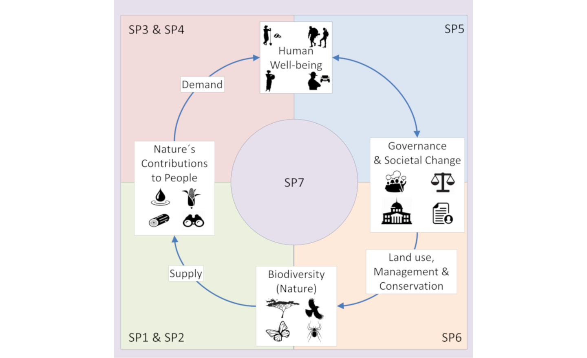

## Project description 
Synthesis – Kilimanjaro as an integrated Social-Ecological System. Learn more about the project [here](https://kili-ses.senckenberg.de/){:target="_blank"}.

## What are we aiming for ?

Tropical mountains are a hotspot of biodiversity, cultural and linguistic diversity, but they face both anthropogenic and climate pressures. Such mountains usually have steep climatic gradients, high diversity of ecosystems and multiple stakeholder groups, thus they provide multiple NCPs, the supply and demand of which then become crucial to identify. 

Mount Kilimanjaro is one such unique tropical mountain. Thus in this project, we work on quantitatively desrcibing and integrating the major components of Kili Social-Ecological System and their interlinkages across the landscape. 

Conceptual social-ecological framework of Kili-SES. Subprojects (SPs) covering each area of the loop are shown in shaded boxes.
<em>Image</em>: [Kili-SES](https://kili-ses.senckenberg.de/en/project/conceptual-framework/){:target="_blank"} 

## What will the course deal with?

In this course, you will get a chance to work with real data and work with methods to upscale biodiversity (and NCPs) from plot level data to landscape level and get an understanding how social-ecological systems work. 

## Why upscale?

Landscape-wide data or upscaled data will help us understand different trade-offs and synergies between supply and demand of different NCPs. 
To understand better how trade-offs and synergies are dealt with, refer to [Manning et al 2018](https://www.nature.com/articles/s41559-017-0461-7){:target="_blank"}.