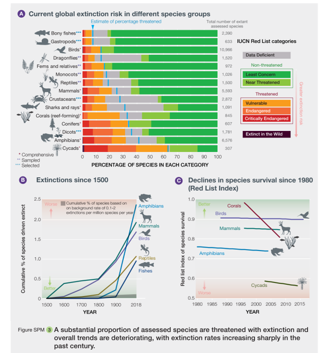

## Nature's Contribution to People  

Global decline in biodiversity is increasingly becoming a concern for general public, scientists, policy makers and decision makers. 
There has been a decline of species richness, abundance, biomass of selected taxonomic groups and reduction in extent of selected natural ecosystems.

<em>Image</em>: [IPBES Global Assessment (2019)](https://ipbes.net/sites/default/files/inline/files/ipbes_global_assessment_report_summary_for_policymakers.pdf)

From the recent IPBES Global Assessment (2019), it was made clear that there is a lack of understanding of interactions 
between different drivers of change. Furthermore there is less understanding of links between indirect drivers, direct drivers and biodiversity change. 
 

Examples of global declines in nature that have been and are being caused by direct and indirect drivers of change.
<em>Image</em>:[ Diaz et al 2019](https://www.science.org/doi/10.1126/science.aax3100){:target="_blank"} 

Thus to address these declines in biodiversity and drivers of changes global experts presented an innovative approach : the concept of using 
Nature's Contribution to People to inform policies and decisions
.
From a very long time, policies were knowledge centric and dominated by natural sciences and economics. The unique concept of NCPs emphasizes that culture is the main link between people and nature, and it also incorporates knowledge systems of local and indegineous communities.

Thus, NCPs are all the contributions including both positive and negative of the living nature. They are further categorized into generalized and conceptual NCPs. 
A detailed description of this can be found in [Diaz et al 2018](https://www.science.org/doi/10.1126/science.aap8826){:target="_blank"}.   

## Additional readings
* [Butchart et al 2010](https://www.science.org/doi/full/10.1126/science.1187512){:target="_blank"}. 
* [Diaz et al 2019](https://www.science.org/doi/10.1126/science.aax3100){:target="_blank"}.  
* [IPBES Global Assessment (2019)](https://ipbes.net/sites/default/files/inline/files/ipbes_global_assessment_report_summary_for_policymakers.pdf)
