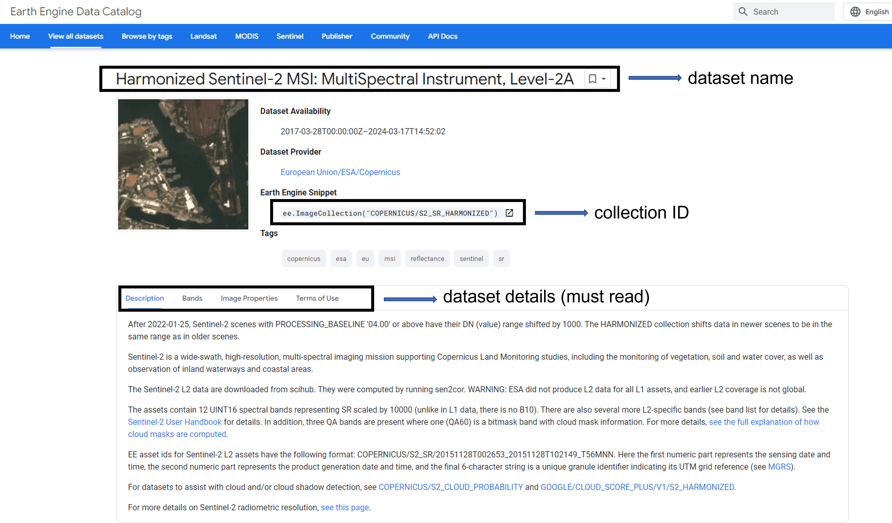
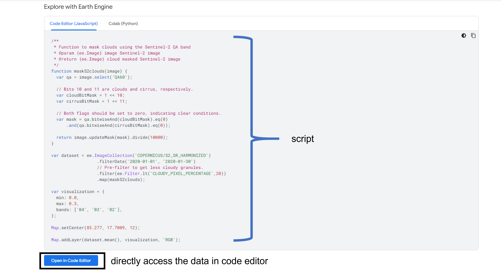

Learn the essentials of Google Earth Engine, Earth Engine Data Catalog and java scripting
<!--more-->


## What is Google Earth Engine? 
[Google Earth Engine](https://earthengine.google.com/) is a powerful platform designed for analyzing and visualizing environmental data. 
Imagine you have a supercomputer that can access a huge library of satellite images of Earth taken over the last few decades. This is what Google Earth Engine provides.

## Why GEE is relevant to us?

**Massive Satellite Imagery Database:** Google Earth Engine has a vast collection of satellite images. This database is constantly updated and includes historical data, which is great for observing changes over time.

**Powerful Computing Resources:** You don't need a high-end computer to use it. Google Earth Engine does the heavy lifting on its servers, so you can run complex analyses and algorithms through a web interface without needing powerful hardware.

**Environmental Monitoring and Analysis:** It's widely used for environmental research like tracking deforestation, monitoring water levels in lakes and rivers, observing the melting of glaciers, and analyzing urban development.

**Accessible to Non-Experts:** The platform is designed to be user-friendly, so even if you're not an expert in remote sensing or geographical information systems (GIS), you can still use it. There's a bit of a learning curve, but there are plenty of tutorials to help you get started.

**Collaboration and Sharing:** You can collaborate with others and share your findings. It's a great tool for group projects or research work.

**Real-World Applications:** The data and insights gained from Google Earth Engine can have real-world implications, such as helping to inform policy decisions on climate change or natural resource management.

## Introduction to the GEE code editor

Once you have signed up for an account with GGE, you can now start playing around with satellite data using the [GEE code editor](https://code.earthengine.google.com/). The code editor is a web-based integrated development environment (IDE) for writing and executing JavaScript code for Earth Engine.
A very well documented guide for working with GEE can be found [here](https://developers.google.com/earth-engine/guides) 


<i>Image: Diagram of components of the Earth Engine Code Editor at code.earthengine.google.com</i>


## Earth Engine Data Catalog

The EE data catalog provides a large variety of raster datasets, which you can browse as well as directly add in the code editor (see below).


<i>Image: [Interface for Earth Engine Data Catalog](https://developers.google.com/earth-engine/datasets/catalog)</i>



<i>Image: [Example from the catalog dataset showing details for Sentinel-2](https://developers.google.com/earth-engine/datasets/catalog/COPERNICUS_S2_SR_HARMONIZED)</i>


<i>Image: [Example from the catalog dataset showing script to access Sentinel-2 data](https://developers.google.com/earth-engine/datasets/catalog/COPERNICUS_S2_SR_HARMONIZED)</i>


## JavaScripting with GEE
To get started with GEE we need to first learn some basics of JavaScript. 
Following are a few necessary functions we will need, but explore [here](https://developers.google.com/earth-engine/tutorials/tutorial_js_01) for further functions.
 
* Variables: to store data values.
```js
var city = "Moshi"
```
* Lists: Stores multiple values in a single variable.
```js
var cities = ['Moshi', 'Marburg']
```	
* Objects: they store key-value pairs, where each value can be referred to by its key.
```js
var cityData = { 'city': 'Moshi', 'coordinates': [3.3430, 37.3507], 'population_2017': 201150  };
print(cityData);
```
* Writing a function: give input to do some computation and get a particular output
```js
var greetings = function(name) { return 'Hello ' + name; }; print(greetings('World')); print(greetings('People'));
```
 * Loading area of study: ee.Geometry.Point(),ee.Geometry.Polygon(),ee.Feature(),ee.FeatureCollection()
```js
var cityLocation = ee.Geometry.Point(cityData.coordinates);
```
* Mapping
```js
// Add the point as a layer to the map
Map.addLayer(cityLocation, {color: 'blue'}, 'Moshi Location');
//Center the map on the city location
Map.centerObject(cityLocation, 9); // '9' is the zoom level, you can adjust it as needed
```
* Data Handling
 * Loading datasets:  ee.Image() and ee.ImageCollection()
```js
var dataset = ee.Image('USGS/SRTMGL1_003'); // elevation raster
var sentinel_collection = ee.ImageCollection('COPERNICUS/S2_SR_HARMONIZED');
```
 * Filtering Data: filter(), filterDate(), and filterBounds() 
```js
var filteredCollection = sentinel_collection
    .filterDate('2020-01-01', '2020-12-31')
    .filterBounds(ee.Geometry.Point(cityData.coordinates))
    .filter(ee.Filter.lte('CLOUDY_PIXEL_PERCENTAGE', 10));
```
 * Image Processing: select(), median(), 
```js
var selectedBands = filteredCollection.select(['B4', 'B3', 'B2']);
Map.addLayer(selectedBands.median(), {min: 0, max: 3000, bands: ['B4', 'B3', 'B2']}, 'RGB Composite'); var medianComposite = sentinelCollection.median();

// Display the composite
Map.addLayer(medianComposite, {bands: ['B4', 'B3', 'B2'], max: 3000};
```


 