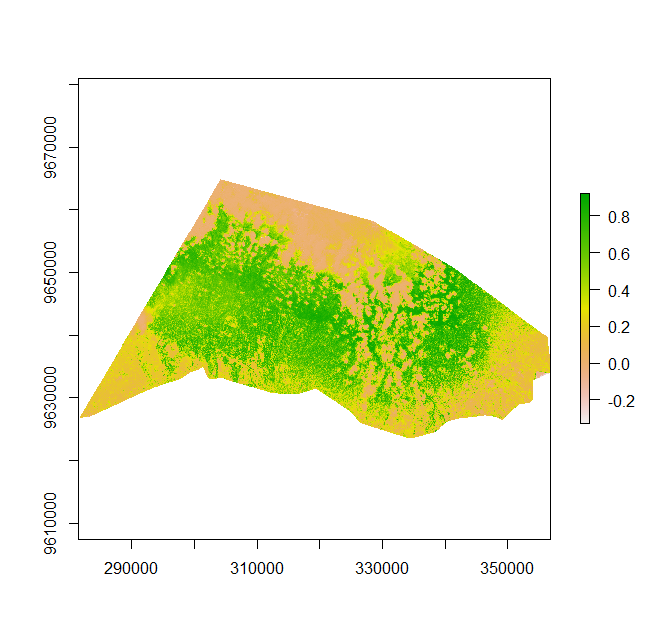

In this exercise we aim to calculate the vegetation indices for our study area.
As a start load your prepared Sentinel Data from the previous exercise.

## Vegetation indices 

* Choose and calculate one vegetation index for the study area. 
* Plot the vegetation index.
* Save the maps of the vegetation index as TIFF file.
* Make a histogram of the derived vegetation index and see how is the data distributed. What does it mean in terms of vegetation?
* Using `raster::cellstats()` calculate the mean and sd of the chosen vegetation index. 

## Visualization
Your vegetation index may look like this example shown below. It shows the Enhanced Vegetation Index for the two Sentinel 2 tiles 37MCS and 37MBS.

<i>Image: Normalised Difference Vegetation Index (NDVI) calculated using Sentinel 2 (Tiles - 37MCS and 37MBS) for the date 09-11-2021.</i>

## Answer the following

* In the above figure , many areas have a value close to 0, why so?
* What measures could be taken before selecting a particular date for downloading a Sentinel 2 imagery?
* How easy or difficult is to separate "agricultural" vs "forest" regions just by visualization?

## Further reading resources 
[Fortunata and Zeuss 2020](https://link.springer.com/chapter/10.1007/978-3-030-76374-9_3){:target="_blank"}

 