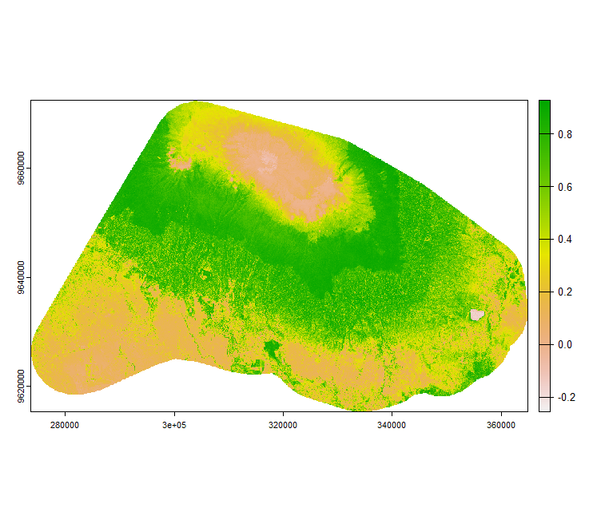

In this exercise, we aim to calculate the vegetation indices for our study area.
As a start, load your prepared Sentinel Data from the previous exercise. The vegetation indices can be calculated in GEE as well as in R.
In this exercise we provide you the code for both platforms. Feel free to try out both. 

## What are vegetation indices 

Vegetation indices in remote sensing are mathematical formulas used to analyze data from satellite or aerial imagery, mainly to assess vegetation health, coverage, and biomass. 
These indices are a crucial tool in environmental monitoring, agriculture, and climate science. For example,

Normalized Difference Vegetation Index (NDVI): Perhaps the most widely used index, NDVI is calculated using near-infrared and red light. 
NDVI values range from -1 to 1, where higher values indicate healthier and denser green vegetation.

Formula: NDVI = (NIR - Red) / (NIR + Red), where NIR is near-infrared reflectance, and Red is red light reflectance.

Enhanced Vegetation Index (EVI): Similar to NDVI but less sensitive to atmospheric effects and more sensitive to high biomass regions.

## Vegetation indices using GEE

```js
// Function to calculate NDVI
function calculateNDVI(image) {
  var ndvi = image.normalizedDifference(['B8', 'B4']).rename('NDVI');
  return image.addBands(ndvi);
}
// Apply NDVI calculation to each image in the collection
var ndviCollection = sentinel2.map(calculateNDVI);
// Reduce the collection by median
var medianNDVI = ndviCollection.select('NDVI').median();
// Clip the NDVI image to the study area
var clippedNDVI = medianNDVI.clip(studyArea);
// Export the NDVI image, specifying scale and region
Export.image.toDrive({
  image: clippedNDVI,
  description: 'Sentinel2_NDVI_Image',
  folder: 'GEE_Folder', // specify your drive folder name
  fileNamePrefix: 'Sentinel2_NDVI',
  region: studyArea.geometry(),
  scale: 10, // Adjust the scale according to your needs
  maxPixels: 1e9, // Adjust if more pixels are needed
  fileFormat: 'GeoTIFF'
});
// Optionally, visualize the NDVI on the map
var ndviVis = {min: -1, max: 1, palette: ['blue', 'white', 'green']};
Map.addLayer(clippedNDVI, ndviVis, 'NDVI');
```
## Vegetation indices using R

* Choose and calculate one vegetation index for the study area.
* Plot the vegetation index.
* Save the maps of the vegetation index as TIFF file.
* Make a histogram of the derived vegetation index and see how the data is distributed. What does it mean in terms of vegetation?
* Use `terra::global()` to calculate the mean and sd of the chosen vegetation index. 

## Visualization
Your vegetation index may look like this example shown below. It shows the Normalised Difference Vegetation Index (NDVI) for the two Sentinel-2 tiles 37MCS and 37MBS.


<i>Image: Normalised Difference Vegetation Index (NDVI) calculated using Sentinel-2 for the date 13-01-2022.</i>


```r
library(terra)
library(RStoolbox)

#if you notice, images downloaded from GEE are in 4 chunks 
# so we need to first load them and merge

s2_df = list.files(path = getwd(), pattern = "jan_2022.+.tif")# gives you a list of the images

mergedRaster <- merge(rast(s2_df[1]), rast(s2_df[2]), rast(s2_df[3]), rast(s2_df[4])) #merges the four chunks
plot(mergedRaster) #make a note of the individual band nomenaclature 
names(mergedRaster) 


indices_to_process <- "NDVI" #try some other indices too such as c("NDVI, "EVI")

Index_layer <- RStoolbox::spectralIndices(mergedRaster, # see ?RStoolbox::spectralIndices for available indices and the required bands
                                          blue = "B2", # add additional bands here if they are required for other vegetation indices
                                          green = "B3",
                                          red = "B4",
                                          nir = "B8",
                                          indices = indices_to_process,
                                          scaleFactor = 1,
                                          skipRefCheck = TRUE)


#plot the indices
plot(Index_layer)
```


## Answer the following questions

* In the above figure, many areas have a value close to 0, why so?
* What measures could be taken before selecting a particular date for downloading Sentinel-2 imagery?
* How easy or difficult is it to separate "agricultural" and "forest" regions just by visualization?

## Further reading resources 
[Fortunata and Zeuss 2020](https://link.springer.com/chapter/10.1007/978-3-030-76374-9_3){:target="_blank"} (also available on ILIAS)

 