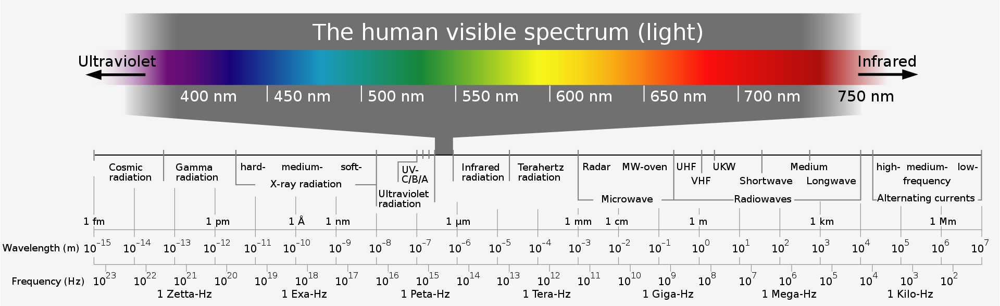
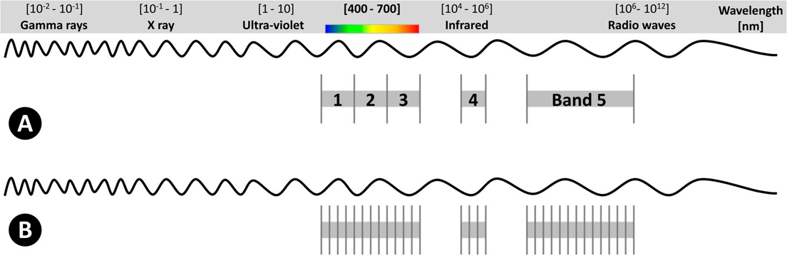
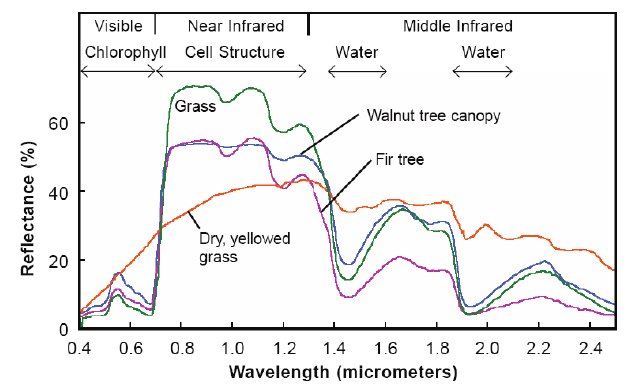
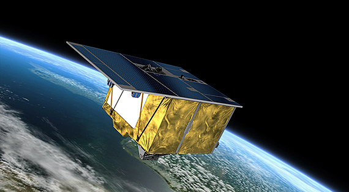
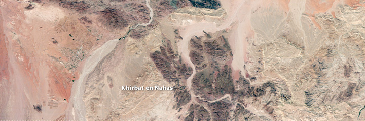
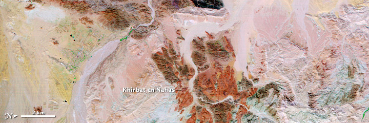

In this unit we introduce Hyperspectral Remote Sensing followed by a practical exercise on deriving useful information from spectral data.
<!--more-->

## Introduction to Hyperspectral Remote Sensing

## The EM Spectrum

The EM spectrum consists of a range of all types of electromagnetic radiation. Surface reflectance at different parts of the spectrum or wavelengths are used for identification of properties of earth surface. This variation in the reflectances allows us to differentiate between different surfaces such as forest or water body. For optical remote sensing we generally use the wavelengths in the infrared to visible range. Optical sensors record the sun radiations reflected from different surfaces on earth along various wavlength intervals; some maybe wide some may be narrow thus defining its spectral resolution.

Electromagnetic Wave Spectrum. Horst Frank / Phrood / Anony - Horst Frank, Jailbird and Phrood [CC BY-SA 4.0]  via 
[wikimedia.org](https://commons.wikimedia.org/w/index.php?curid=3726606#/media/File:Electromagnetic_spectrum_-eng.svg){:target="_blank"}. 

## What is Hyperspectral RS?

Imaging spectroscopy or hyperspectral remote sensing acquires images that contains several contiguous bands of narrow range acquired by airborne or spaceborne sensors, resulting in a continuous spectrum. So the wavelength range in such a spectrum can be as small as 5 nm as opposed to 30 nm in multispectral sensors like Landsat.
Such a spectrum aids in the assessment, identification and quantification of differnt surfaces on earth. 

 
Spectrum representation including (A) Multispectral example, with 5 wide bands; and (B) Hyperspectral example consisting of several narrow bands that, usually, extends to hundreds or thousands of them (image not drawn to scale).
Image : [Adão et al 2017](https://www.mdpi.com/2072-4292/9/11/1110#){:target="_blank"}.

## Understanding a spectra

Hyperspectral imagers use instruments called imaging spectrometers which work on the pricniples of spectroscopy. The fundamental property we want to study is the spectral reflectance defined as the ratio of reflected energy to incident energy as a function of wavelength. 
Different surfaces will thus have different reflectances depending on degree of how the incident radiations are absorbed and scattered. 
Such differences become evident when we plot reflectance vs wavelengths, aka spectral reflectance curves. 
Lets look at the example below to understand a plant spectra. 

Reflectance spectra of different types of green vegetation compared to a spectral signature for senescent leaves.
Image : [Govender et al 2007](https://www.mdpi.com/2072-4292/9/11/1110#){:target="_blank"}.

## Multispectral vs Hyperspectral

<table>
<tr>
    <th style="background-color: lightgrey">Mutispectral </th>
    <th style="background-color: lightgrey">Hyperspectral</th>
</tr>
  <tr>
    <td>Many sensors including Landsat and MODIS</td>
    <td>Very few satellite sensors are available, some are mission-specific sensors onboard ISS while many are airborne sensors onboard planes or UAVs.</td>
  </tr>
  <tr>
    <td>A limited number of spectral bands are available</td>
    <td>Multiple narrow bands which measure the characteristic of surface reflectance</td>
  </tr>
<tr>
    <td>Temporal resolution is relatively high</td>
    <td>Lower temporal resolution</td>
  </tr>
<tr>
    <td>Gives a global extent</td>
    <td>Lesser spatial coverage</td>
  </tr>
</table>

## Applications of Hyperspectral RS

Hyperspectral RS has numerous applications in the field of agriculture, soil sciences, hydrology, marine sciences, biodiversity and conservation, hazard and risk assessment and natural resource management. 

Listen to an expert [here](https://youtu.be/g6zSSjBK1Vk){:target="_blank"}.

## Some examples of Hyperspectral imagers

#### EnMAP

Environmental Mapping and Analysis Program (EnMap)  is the latest released  optical earth remote sensing mission in orbit by the DLR, Germany. 
It aims to acquire high-quality hyperspectral image data with 230 spectral channels in the solar-reflectance range on a frequent basis with high geometric resolution. The satellite will measure, derive, and analyze different parameters related to agriculture, forestry, soil, and geological environments, as well as coastal zones and inland waters. Further, it will also provide a  status of different ecosystems and their response to natural or man-made changes in the environment. It has a spatial resolution of 30m

EnMAP - the first German Hyperspectral sensor in space. Image : [DLR](https://www.dlr.de/rd/desktopdefault.aspx/tabid-2440/3586_read-28911/){:target="_blank"}. 

Read more about the newly launched satellite [here](https://www.enmap.org/) and watch an interesting video [here](https://youtu.be/LQZNtLp3RfM).

#### EO -1 Hyperion

The Earth Observing -1 satellite (EO-1) was launched in 2000, November 1 and chartered the Hyperion and the Advanced Land Imager sensor. The Hyperion collects 220 unique spectral channels in the range of 357 nm - 2567 nm having a bandwidth of 10 nm. It has a 30 m spatial resolution with 7.75 km swath.

Hyperion Images of outcrops near one of the largest mining operations in Jordan (Khirbat en-Nahas) With a natural-color image (top) the minerals appear uniformly dark, but different rock types can be identified with the many spectral bands in Hyperion (bottom).
Image: [NASA](https://earthobservatory.nasa.gov/features/EO1Tenth/page3.php){:target="_blank"}.

Read more about Hyperion [here](https://directory.eoportal.org/web/eoportal/satellite-missions/e/eo-1){:target="_blank"}.

#### ECOSTRESS
The ECOsystem Spaceborne Therman Radiometer Experiment on the ISS . It was launched on 29 June 2018. ECOSTRESS monitors the loss of water in plants via evapotranspiration. It has a spatial resolution of 70m with 6 bands between 160-1200 nm. The range of data is between 53.6° N latitude to 53.6° S latitude.

This map shows the Evaporative Stress Index on May 24, 2020. This observation was obtained from NASA’s ECOSTRESS which measured small difference in the surface temperature of plants to establish the Evaporative Stress Index (ESI), an index used to measure water deficiency; in the Ganges river delta,India. In the regions with abundant water, ESI was low (green) compared to developed land (red) where ESI is around 90%. 
Image: [NASA](https://ecostress.jpl.nasa.gov/gallery/viewgalleryimage){:target="_blank"}.

#### AVIRIS

Airborne Visible/ Infrared Imaging Spectrometer delivers calibrated images of the upwelling spectral radiance in total of 224 contiguous spectral bands. The bands range between 400nm to 2500 nm. It was launched on January 1, 1993 and has been flown on 4 aircraft platforms : NASA's high altitude ER-2 jet, Twin Otter International's turboprop, Scaled Composites' Proteus, and NASA's WB-57.

Read more about AVIRIS [here](https://aviris.jpl.nasa.gov/){:target="_blank"}. 

#### Other common hyperspectral imagers 
* [PRISMA](https://earth.esa.int/web/eoportal/satellite-missions/p/prisma-hyperspectral){:target="_blank"}
* [HICO](https://www.nasa.gov/mission_pages/station/research/benefits/hico/){:target="_blank"}
* [CORAL](https://airbornescience.jpl.nasa.gov/campaign/coral){:target="_blank"}
