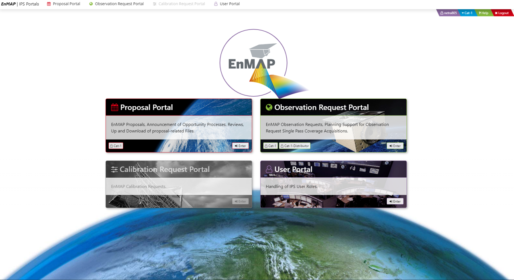
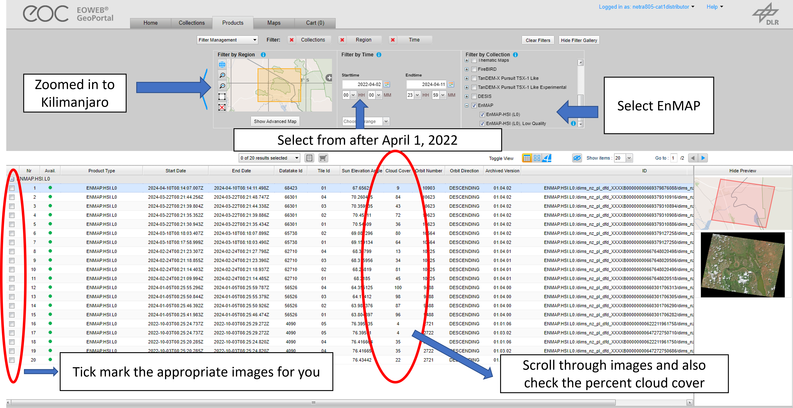

In this exercises you will get a hands on demo how you can download and work with EnMAP hyperspectral data. 
<!--more-->

## Getting started with EnMAP data

Since, EnMAP was launched very recently (April 1, 2022), there is not sufficient data available to users for study regions outside Europe. 
In this exercise , we demonstrate how in future you can easily request and download the images for your study region. 

### Registration with EnMAP 

1. Go to the [EnMAP website](https://www.enmap.org/data_access/){:target="_blank"} and select the [data access portal](https://planning.enmap.org/){:target="_blank"}.  
1. Click on the "Signup" option and you will be prompted with a long form. Please fill it according to your details. This is followed by accepting the terms and conditions.  
   The user must accept License files before registration approval. The registration confirmation comes as a link in email , please select the link and then you are successfully registered. 
1. After the successful registration process you can now login at the Instrument Planning Portal by clicking at the login button. 
1. You will then be prompted to the Instrument Planning Portal Home Page (see below)

Image: Instrument Planning Portal Home Page

### User portal 

1. Go to "User Portal" and then "Enter". The purpose of this form is to provide Users access to all portals. 
1. User Role assignment - In the User Portal the user should scroll down to Role Assignment and assign as role Cat-1, for the Announcement of Opportunity (AO) , which is required for Proposal
submission and future observation requests or as role Catalogue User (Cat1-Distributor) for receiving access to the EnMAP Data archive. Other users are not available for external users of EnMAP. 
You will get an email once you have been assigned the role of Cat-1 and Catalogue User (Cat1-Distributor), usual;ly in one day. 
1. Once you are assigned the roles you can scroll down in the same user portal and go to "EOWEB Users" and login to access the data archive (see below). 
   Refill your login details, the password remains same as set before.  

Image: Login to EOWEB Users portal

### Downloading EnMAP data 

1. Once you are in the EOWEB portal, you can now select a study area , filter the dataset by date and time, and collection- EnMAP(see below). 

Image: Login to EOWEB Users portal

