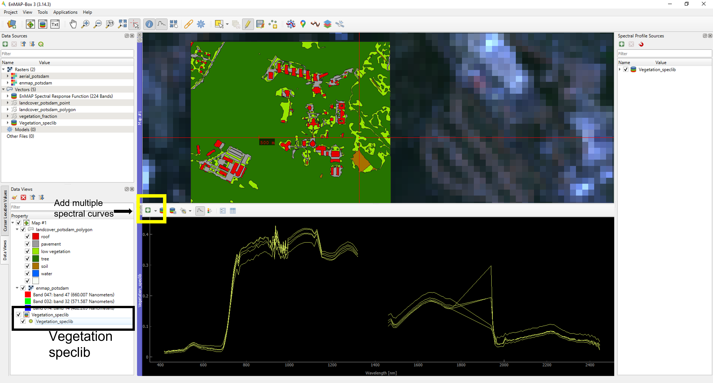
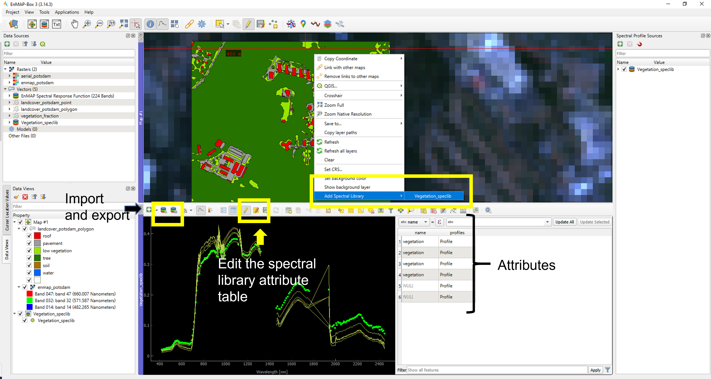

In this exercise, we will understand how to use EnMap data in QGIS using the plugin EnMap-Box.
<!--more-->

For a smoother workflow in this exercise, ensure you have the latest QGIS install (version 3.34+) and we will work with the latest version EnMAP Box as well. 
{: .notice--info}

## Getting started with EnMap-Box

EnMap-Box is a free and open source QGIS based plugin to visualize and process hyperspectral data. 

Please refere [here](https://www.enmap.org/data_tools/enmapbox/){:target="_blank"} for the detailed information on EnMAP-Box.

## Working with EnMAP-Box in QGIS

Follow the steps mentioned below to install the EnMAP-Box plugin in your QGIS.
Incase you haven't worked with QGIS before, you can download it [here](https://www.qgis.org/en/site/forusers/download.html){:target="_blank"}
and use the training material from [here.](https://docs.qgis.org/3.34/en/docs/training_manual/index.html){:target="_blank"}

- Installing EnMap-Box
Open QGIS and on the top locate "Plugins" followed by "Manage and install plugins". In the subsequent dialog box, search for "EnMap box" and install the right option one as shown below.

Image: EnMap-Box plugin. Source: Netra Bhandari

- Next, in the processing tools menu look for the EnMAP-Box, or search for the icon of EnMAP on the toolbar.

Image: EnMap-Box plugin. Source: Netra Bhandari

- You will be prompted with a new window. 
Incase you are asked to install dependend packages please follow the guidelines mentioned [here.](https://enmap-box.readthedocs.io/en/latest/usr_section/usr_installation.html){:target="_blank"}

Image: EnMap-Box GUI. Source: Netra Bhandari

- EnMap box features

The EnMap box comes with a variety of tools and applications. Take your time to through the EnMap Box. To learn further please refer to this [user manual](https://enmap-box.readthedocs.io/en/latest/usr_section/usr_manual/usr_manual.html){:target="_blank"}.
For this unit we largely focus on the following:
	- Map view
	- Spectral library view

## Task 1

The EnMap-Box comes with a loaded example dataset. In the EnMap-Box window go to "Project" and select "Add Example Data".

You will be prompted by a dialogue box "Download testdata from 
https://github.com/EnMAP-Box/enmap-box-exampledata/releases/download/v1.1/exampledata.zip?" . Click on "Yes". This loads in the example data on your computer.

Once executed, in your data source there will be the following layers: 

	- Raster - "aerial potsdam" (showing an aerial view, a 4 band raster) , "enmap_potsdam" (showing a hyperspectral view, a 224 band raster)
	- Vector - "EnMap Spectral Response Function", "landcover_potsdam_point", "landcover_potsdam_polygon" and "vegetation_fraction"

- Let's load a new map view, and check the layer properties. To get a true color composite you can set your RGB bands as Band 047 (RED), Band 032 (GREEN), and Band 14 (BLUE).

- Next we look at pixel based information.

For this click on 'Identify a cursor location" on the tool bar shown with and arrow followed by "identify cursor location values" as shown in the image below.
To look at the spectral profile click on "identify pixel profiles and show them in a spectral library". 
Now take some time to explore the different tools provided in the spectral library viewer.
 

Image: EnMap-Box pixel and spectral information. Source: Netra Bhandari

Next we will load a polygon data (vector). 

Select, drag and drop the "landcover_potsdam_polygon" layer in the mapview. 
Lets get the spectral profile for vegetation. 

Image: EnMap-Box vegetation spectral library. Source: Netra Bhandari

Since the spectral library is a vector layer, it has an attribute table, which we can edit. This vector layer can then also be added to the mapview and can be exported as well.

Image: EnMap-Box vegetation spectral library attrbute table. Source: Netra Bhandari

Based on the above instructions, load and understand the spectral profile of the following surfaces.
- roof
- pavement
- low vegetation
- tree
- soil
- water

Compare the spectral profiles between an aerial imagery vs an EnMap imagery. 

## Task 2

A few EnMap scenes are provided to you [here](http://85.214.102.111/kili_data/){:target="_blank"}. You can load files ending with "spectral_image_swir" or "spectral_image_vnir".
Along with this , a shapefile with 3 classes is given as well.

To add a EnMAP product , use the following
Project ->  Add prodcut -> Select approporiate product (for this exercise select EnMAP L1B). Now select your metadata file and give appropriate names to swir and nir layers e.g. "swir_kili.vrt", or "vnir_kili.vrt". 
{: .notice--info}

- What is the spectral resolution of this image?
- Get the spectral profiles (take a screenshot of the spectra ) for each class and also save it as geopackage and ENVI formats.

Please note this unit is for demonstration purpose. We will not use hyperspectral data in the upscaling process due to lack of sufficient EnMap scenes for Kilimanjaro.  
{: .notice--info}