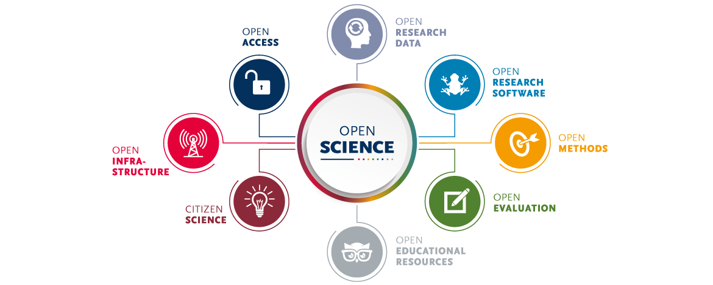

learn about open science ... <to do> 

## What is Open Science

[Image source](https://images.app.goo.gl/HpHJxQZ2Kbnmi3PeA)
## Open data

### FAIR data 

-F - Findable - easy discovery by both researchers as well as computers
-A - Accessible - easy availablity under well defined conditions
-I - Interoperable - easy integration and sharing across different platforms
-R - Reusable - optimize the reuse of research data

Read in detail about the FAIR principles [here](https://www.go-fair.org/fair-principles/)

## Collaborating and sharing your knowledge

- github and gitlab
- quartro
- google collab

## open science framework

[Open science framework](https://youtu.be/X07mBq2tnMg?si=_7PbiZl_87h1zH6E)  