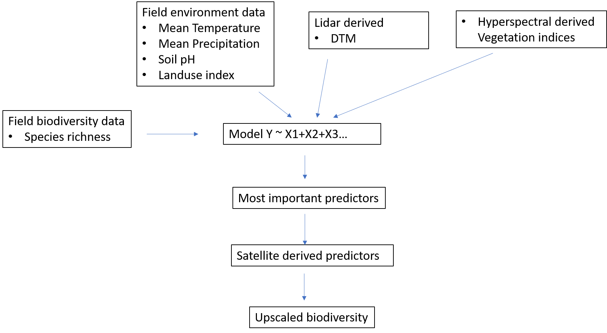

## Why upscale?
<!--more-->

Mapping biodiversity at large scales is essential for environmental monitoring and conservation. However, it is time and labor intensive to monitor biodiversity at ground level. 
Using upscaled data can further help in accounting for different Nature's Contributions to People (NCPs) by transferring "local" information to "regional" scale. 

Upscaled data thus offers advantages for regional assessments via survyes that can be nested spatially, further reducing the mis-matches between the scale of different biophysical processes driving biodiversity. 

## Upscaling framework

* Identifying the different predictors that influence biodiversity - in our case plants
* Preparing a common dataset with values of selected predictors identified at local scale
* 

## T.B.D
