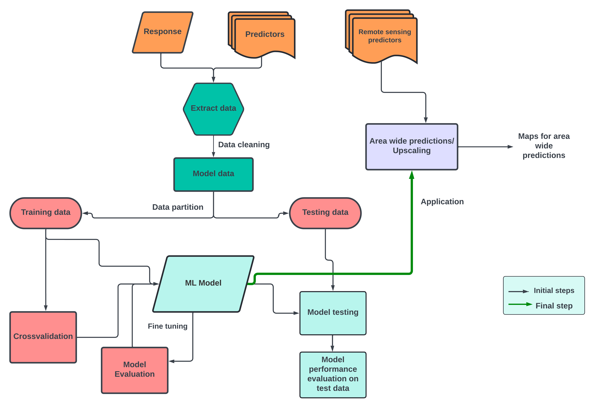

## Upscaling workflow

The key concept of upscaling is making area-wide predictions from a given set of environmental variables that serve as the drivers of the response variable.
Machine learning algorithms such as Random Forest have proven to be very useful in making such area-wide predictions. 
In our course, we will look at what goes in an upscaling workflow and find a suitable model to upscale the Kilimanjaro plot level data to regional scales.

## Understanding the workflow

We can define the upscaling workflow in the following stages

1. Gathering predictors and response variables
2. Data pre-processing
3. Finding the right model based on our research question
4. Training and testing the model
5. Evaluating the model
6. Applying the model on a set of remote sensing proxies of our predictors

Source: Netra Bhandari
 

