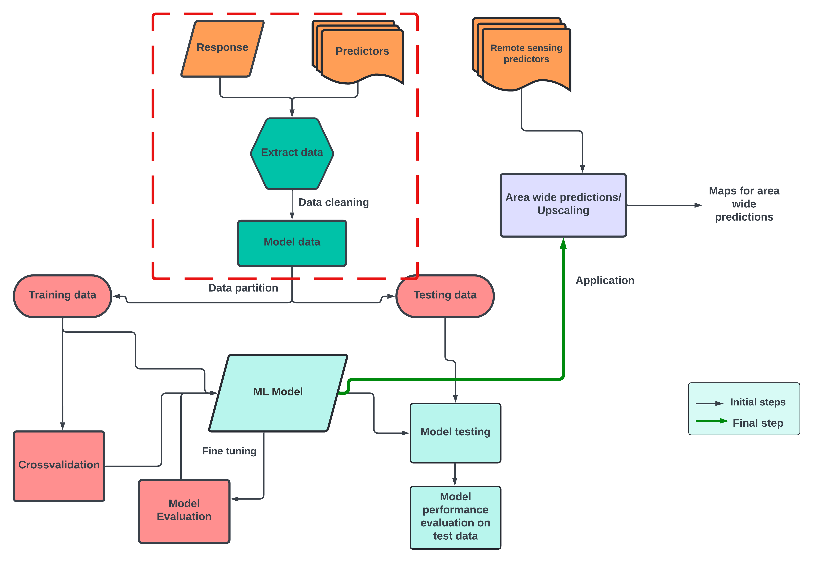

## Data preparation 

In this part you will use your previously acquired skills to prepare data for designing a suitable model for predicting plant species richness.
To predict plant species richness, we need a set of predictors. An important note to keep in mind that we will use these predictors for upscaling, thus we choose only those variables for which we can find a suitable remote sensing proxy. 

In the data preparation task you will:

* Think of possible factors that influence the plant species richness in your study region (Hint: do a quick google search)
* Get a dataframe ready with all the predictors at plot level
* Perform data cleaning to remove any missing values

Source : Netra Bhandari

## Predictors for plant richness
Plant richness and abundance is an indicator of mutiple Nature's Contributions to people such as - carbon storage, habitat creation and maintenance (regulating NCPs), learning and inspiration (non-material NCPs) and material NCPs (abundance of plants providing timber and fulewood ).

Some of the important drivers of plant richness are elevation, mean minimum temperature, NDVI (as a proxy for net primary productivity), pH, slope, aspect. Landuse intensity has also been a major driver of plant richness (Peters et al 2019) , however we in this exercise we limit our study to only those drivers for which previously known remote sensing proxies are available.

## Predictors and response put together

Source: Netra Bhandari