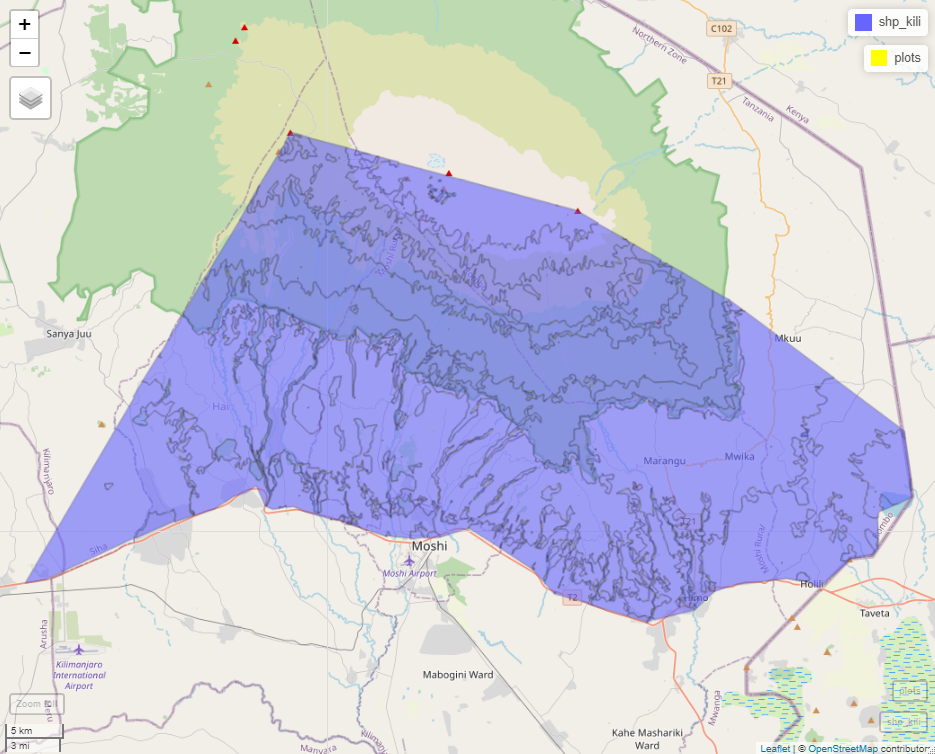
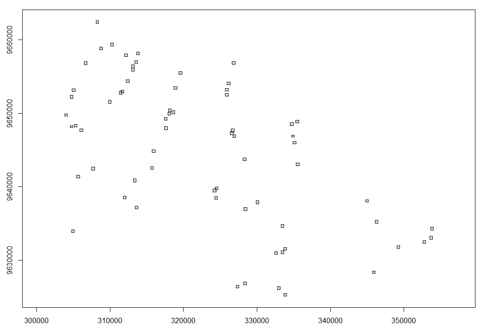
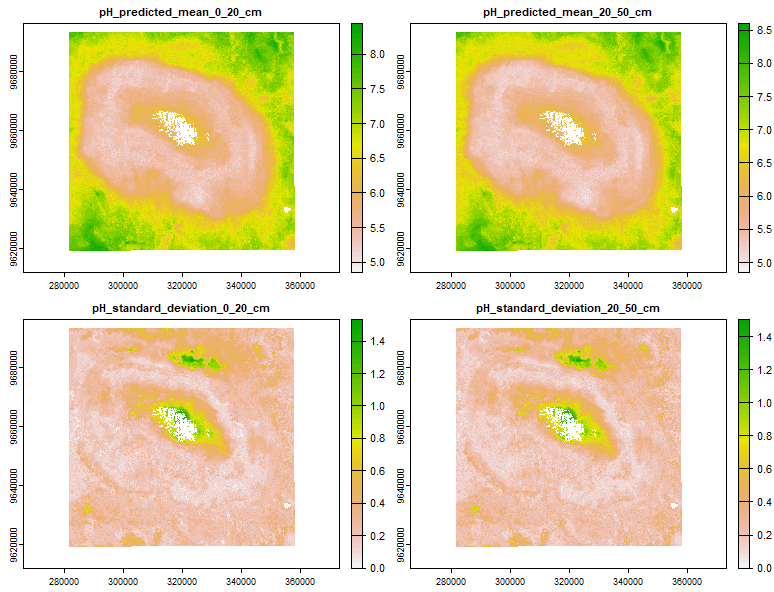

In order to model and upscale plant richness, we will need plot level information for each of our predictors. 

## Getting plot locations

```r
# load the following libraries

library(lidR) # for lidar data # last updated 4 may, please get latest version
library(hsdar) # for hyperspectral data
library(terra)
library(here)
library(sf)
library(dplyr)
library(tidyverse)
library(ggplot2)
library(pbapply)
library(mapview)
library(RCSF)

#set working directory

setwd("D:/Kili_SES/course_bsc_upscaling_netra/upscaling_methodology")


##############
# Area of interest
##############

shp_kili <- sf::st_read("./upscaling_data/vectors/VegAug1_KILI_SES.shp")

shp_kili <- sf::st_transform(shp_kili,  32737) #epsg code for kili is 32737, you can also use UTM 37S

                                       
##########################
# load the plots shapefile
###########################

plots <- sf::st_read("./upscaling_data/vectors/BPolygon.shp")

## lets plot and see our aoi and plots

mapview::mapview(shp_kili)+
  mapview::mapview(plots, col.regions = "yellow")

```


## LiDAR data

* Get the elevation, aspect and slope data for each plot using LiDAR dataset provided to you.

```r
#############
# 1.  LiDAR data
#############

## we need to clip our raw lidar data according to the extent of the plots
path <- "D:/Kili_SES/course_bsc_upscaling_netra/LiDAR/data"
list_las_files  <-list.files(file.path(paste0(path,"/raw_lidar/lidar_point_clouds/")),
                                 pattern = "_clipped_roi.las",
                                 full.names = TRUE)

head (list_las_files, n = 5) #5 file paths

# read in las catalog
las_ctg <- readLAScatalog(list_las_files) # around 569.8kb , 67 tiles
plot(las_ctg) ## notice that some tiles are overlapping
```


```r
# we clip based on our plots 
dir.create(path = paste0(path,"/output_dir")) #make a new dir for saving your clipped files
aoi_path <- paste0(path,"/output_dir")

opt_output_files(las_ctg) <- paste0(aoi_path,"/{PlotID}") # lets call it it now aoi to avoid confusing with roi, you can also choose better names
ctg_clip <- clip_roi(las_ctg,plots, radius = 100) # this step will take time be patient!

#remove noise
ctg_aoi <- readLAScatalog(list.files(aoi_path, full.names = T))

#function
filter_poi_noise = function(las)
{
  # The function is automatically fed with LAScluster objects
  # Here the input 'las' will a LAScluster
  
  las <- readLAS(las)                          # Read the LAScluster
  if (is.empty(las)) return(NULL)              # Exit early (see documentation)
  
  las <- filter_poi(las, Classification != 18)          
  return(las)                                  # Return the filtered point cloud
}


opt_output_files(ctg_aoi) <- paste0(aoi_path,"/{*}_noise")
ctg_aoi <- classify_noise(ctg_aoi, sor(15,7))

#denoise using function filter_poi_noise
opt_output_files(ctg_aoi) <- paste0(aoi_path, "/{*}_denoise")
ctg_aoi <- catalog_apply(ctg_aoi, filter_poi_noise)

#work with denoised data from here on
ctg_aoi <- readLAScatalog(list.files(aoi_path, pattern = "_denoise.las", full.names = T))

#classify ground
opt_output_files(ctg_aoi) <- paste0(aoi_path, "/{*}_classified")
ctg <- classify_ground(ctg_aoi, csf())

dir.create(paste0(aoi_path, "/dtm"))
dtm_path <- paste0(aoi_path, "/dtm")
opt_output_files(ctg) <- paste0(dtm_path, "/{*}_dtm")
dtm <- rasterize_terrain(ctg, res = 10, algorithm = knnidw(k = 10L, p = 2)) 

crs(dtm) <- crs(vect(shp_kili)) #add crs to dtm
#plot(dtm)

# aspect and slope
aspect <-  terra::terrain(dtm, v="aspect")
writeRaster(aspect,paste0(dtm_path,"/asp.tif"))
slope  <-  terra::terrain(dtm, v="slope")
writeRaster(aspect,paste0(dtm_path,"/slope.tif"))

plot_extract <- terra::extract(c(dtm,aspect,slope),vect(plots), fun = mean, na.rm =T)

plot_extract$ID <- plots$PlotID
colnames(plot_extract) <- c("PlotID","mean_dtm","mean_aspect", "mean_slope")
write.csv(plot_extract, "./plot_extract.csv") #just save a backup 

# Note - for your final projects you can explore multiple ways of using lidar data!

```

## Hyperspectral data
* Get the necessary vegetation indices for each plot using hyperspectral rasters provided to you.


```r
####################
# 2. Hyperspectral
####################

# Getting the hyperspectral rasters

path_hyp <- "D:/Kili_SES/course_bsc_upscaling_netra/Hyperspectral/hyperspectral_rasters/"
hy_fls <- list.files(path_hyp, pattern = ".tif", full.names = T) # 63 rasters

#34 plots in 2015
flight_1_plot_list <- c("cof1", "cof2", "cof3", "cof4", "cof5", "cof6","mai1", "mai2", "mai3","mai4","mai5", "sav1", "sav2", "sav3", "sav4", "sav5",
                        "hom4", "flm1", "flm2","gra2", "gra3", "gra4" ,"gra5", "gra6","flm6","hom5","hom1", "hom2","hom3","foc1","fod5","gra1","flm3", "flm4")

#29 plots 2016
flight_2_plot_list <- c("fed1","fed2","fed3","fed4","fed5","fer0","fer2","fer3","fer4","foc2","foc3","foc4","foc5","fod1","fod2","fod3","fpd2","fpd3","fpd4","fpd5","fpo1","fpo2","fpo3","fpo4","fpo5","hel1","hel2","hel3","hel4")


hy_fls_2015 <- hy_fls[grepl(pattern = paste(flight_1_plot_list, collapse = "|"), hy_fls)] # mai5 is missing

hy_fls_2016 <- hy_fls[grepl(pattern = paste(flight_2_plot_list, collapse = "|"), hy_fls)]


list_hy_fls1 <- pbapply::pblapply(seq_along(hy_fls_2015),
                                  function(x){
                                    sf::st_as_sf(as.polygons(terra::ext(rast(hy_fls_2015[[x]])),
                                                             crs="EPSG:32737"))
                                  })

list_hy_fls2 <- pbapply::pblapply(seq_along(hy_fls_2016),
                                  function(x){
                                    sf::st_as_sf(as.polygons(terra::ext(rast(hy_fls_2016[[x]])),
                                                             crs="EPSG:32737"))
                                  })

# lets load lidar to make our extents same 

lidar <- list.files("D:/Kili_SES/course_bsc_upscaling_netra/LiDAR/data/output_dir/dtm", pattern = "_dtm.tif", full.names = T) #66 rasters
length(lidar)


lidar_1 <- lidar[grepl(pattern = paste(flight_1_plot_list, collapse = "|"), lidar)]
lidar_2 <- lidar[grepl(pattern = paste(flight_2_plot_list, collapse = "|"), lidar)]


lidar_extent1 <- pbapply::pblapply(seq_along(lidar_1),
                                   function(x){
                                     sf::st_as_sf(as.polygons(terra::ext(rast(lidar_1[[x]])),
                                                              crs="EPSG:32737"))
                                   })

lidar_extent2 <- pbapply::pblapply(seq_along(lidar_2),
                                   function(x){
                                     sf::st_as_sf(as.polygons(terra::ext(rast(lidar_2[[x]])),
                                                              crs="EPSG:32737"))
                                   })

#now we do intersection 

list_ext_intersection_lidar_hs1 <- pbapply::pblapply(seq_along(list_hy_fls1),
                                                     function(x){
                                                       sf::st_intersection(lidar_extent1[[x]],
                                                                           list_hy_fls1[[x]])
                                                     })

list_ext_intersection_lidar_hs2 <- pbapply::pblapply(seq_along(list_hy_fls2),
                                                     function(x){
                                                       sf::st_intersection(lidar_extent2[[x]],
                                                                           list_hy_fls2[[x]])
                                                     })

# based on intersection we can crop our hypersepctral rasters

list_ext_intersection_lidar_hs1 <- pbapply::pblapply(seq_along(hy_fls_2015),
                                                     function(x){
                                                       crop(rast(hy_fls_2015[[x]]),
                                                            terra::ext(vect(list_ext_intersection_lidar_hs1[[x]])))
                                                     })

list_ext_intersection_lidar_hs2 <- pbapply::pblapply(seq_along(hy_fls_2016),
                                                     function(x){
                                                       crop(rast(hy_fls_2016[[x]]),
                                                            terra::ext(vect(list_ext_intersection_lidar_hs2[[x]])))
                                                     })

# getting the band info 
# careful we have two band_info files - 2015 and 2016


#wavelength - take notice - 2015 has 160 abnds and 2016 has 158 abnds
band_info_2015 <- read.csv("D:/Kili_SES/course_bsc_upscaling_netra/Hyperspectral/band_info/band_meta_2015.csv")
band_info_2016 <- read.csv("D:/Kili_SES/course_bsc_upscaling_netra/Hyperspectral/band_info/band_meta_2016.csv")

str(band_info_2016) #gives a view of how the data looks

# get the wavelengths for the speclib
wavelength_2015 <- as.numeric(parse_number(band_info_2015$styles.title[2:161])) #160 bands
wavelength_2016 <-  as.numeric(parse_number(band_info_2016$styles.title[2:159])) #158 bands


# data cleaning
hy_names_2015 <- substr(hy_fls_2015, 76,79) #34 this might change based on length of your file names #34 total

hy_names_2016 <- substr(hy_fls_2016, 76,79) #29 total

#make a list of your chosen vegetation indices 
# we only need one for our example - NDVI as a proxy for Net Primary Production
vi = "NDVI"

#lets calculate vegetation indices by making a speclib
library(future)
future::plan(multisession, workers = 2L) #makes processing faster!

vi_stats_2015 <- lapply(seq(length(list_ext_intersection_lidar_hs1)), function(i){
  
  hy_2015 <- speclib(brick(list_ext_intersection_lidar_hs1[[i]]), wavelength_2015)
  hy_indices_2015 <- vegindex(hy_2015, index = vi)
  hy_indices_2015 <- hy_indices_2015@spectra@spectra_ra
  names(hy_indices_2015) <- vi
  
  #writeRaster(hy_indices_2015, filename = paste0(file.path(wd, "output/veg_indices_raster",hy_names_2015[i], "_vegindex.tif")))
  
  vi_means_2015 <- as.data.frame(t(cellStats(hy_indices_2015, stat = "mean", na.rm = TRUE)))
  vi_sd_2015 <- as.data.frame(t(cellStats(hy_indices_2015, stat = "sd", na.rm = TRUE)))
  
  vi_mean <- data.frame(PlotID = hy_names_2015[i], vi_means_2015)
  names(vi_mean)[2] <- paste( vi,"_mean", sep = "")
  
  vi_sd <- data.frame(PlotID = hy_names_2015[i], vi_sd_2015)
  names(vi_sd)[2] <- paste(vi, "_sd", sep = "")
  
  vi_table <-  left_join(vi_mean, vi_sd, by = "PlotID")
  
  return(vi_table)
  
})

vi_table_2015 <- do.call(rbind, vi_stats_2015)


vi <- "NDVI"
future::plan(multisession, workers = 2L)


vi_stats_2016 <- lapply(seq(length(list_ext_intersection_lidar_hs2)), function(i){
  
  hy_2016 <- speclib(raster::brick(list_ext_intersection_lidar_hs2[[i]]), wavelength_2016)
  hy_indices_2016 <- vegindex(hy_2016, index = vi)
  hy_indices_2016 <- hy_indices_2016@spectra@spectra_ra
  names(hy_indices_2016) <- vi
  
  #writeRaster(hy_indices_2016, filename = paste0(file.path(wd, "output/veg_indices_raster",hy_names_2016[i], "_vegindex.tif")))
  
  vi_means_2016 <- as.data.frame(t(cellStats(hy_indices_2016, stat = "mean", na.rm = TRUE)))
  vi_sd_2016 <- as.data.frame(t(cellStats(hy_indices_2016, stat = "sd", na.rm = TRUE)))
  
  vi_mean <- data.frame(PlotID = hy_names_2016[i], vi_means_2016)
  names(vi_mean)[2] <- paste( vi,"_mean", sep = "")
  
  vi_sd <- data.frame(PlotID = hy_names_2016[i], vi_sd_2016)
  names(vi_sd)[2] <- paste(vi, "_sd", sep = "")
  
  vi_table <-  left_join(vi_mean, vi_sd, by = "PlotID")
  
  return(vi_table)
  
})

vi_table_2016 <- do.call(rbind, vi_stats_2016)

vi_table <- rbind(vi_table_2015, vi_table_2016)
write.csv(vi_table, "./vi_table.csv")
```

## Mean minimum temperature
* Get the temperature data (in this case mean of minimum temperature) for each plot

```r
#############################
# 3. mean minimum temperature
#############################

mmt <- read.csv("./upscaling_data/plot_data/temp_kili_stations_averaged.csv", row.names = 1)
colnames(mmt)
mmt <- mmt[,c(1,15)]
head(mmt, n = 2)
# PlotID  mean_mmt
#1   cof1 19.443259
#2   cof2 19.759052

```

## pH
* Get the pH for each plot

```
#############################
# 4. pH
#############################

pH <- rast("./upscaling_data/rasters/ph_kili.tif")
plot(pH)

ph_df <- terra::extract(pH,vect(plots), fun = mean, na.rm =T)
ph_df$ID <- plots$PlotID
names(ph_df)[1] <- "PlotID"
```


## All things together
* Gather all the derived plot level information in a single dataframe.

```r
################################
# 5. Making a single dataframe
################################

#we make use of the left_join function in the dplyr library 

predictors <- purrr::reduce(list(plot_extract,mmt,ph_df, vi_table), dplyr::left_join, by = 'PlotID')

#great we are now ready with our list of predictors

#lets add our response variable

plantsSR <- read.table("upscaling_data/plot_data/Biodiversity_Data.csv", sep = ",", header = T)
colnames(plantsSR)
plantsSR <- plantsSR[,c(1,2,17)]
names(plantsSR)[1] <- "PlotID"

model_data <- purrr::reduce(list(predictors,plantsSR), dplyr::left_join, by = 'PlotID')
head(model_data, n = 2)
#PlotID mean_dtm mean_aspect mean_slope mean_mmt pH_predicted_mean_0_20_cm pH_predicted_mean_20_50_cm pH_standard_deviation_0_20_cm pH_standard_deviation_20_50_cm   NDVI_mean     NDVI_sd cat SRallplants
#1   cof1 1282.446    150.7041   6.639121 19.44326                  5.735425                   5.735425                           0.2                      0.2144840 0.8543281 0.1302960 cof          59
#2   cof2 1323.983    209.7581   2.697647 19.75905                  5.978076                   5.915743                           0.2                      0.1520235 0.7731032 0.1623179 cof          44
write.csv(model_data, "./model_data.csv")
```


