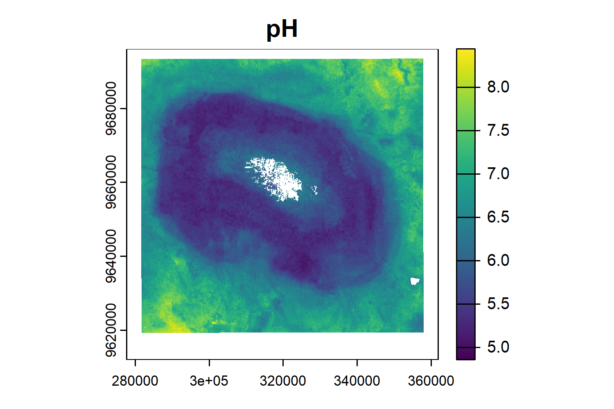

In order to model and upscale plant richness, we will need plot level information for each of our predictors. 

## Getting plot locations

```r
# load the following libraries

library(lidR) # for lidar data # last updated 4 may, please get latest version
library(terra)
library(here)
library(sf)
library(dplyr)
library(tidyverse)
library(ggplot2)
library(pbapply)
library(mapview)
library(RCSF)

#set working directory

setwd("D:/Kili_SES/course_bsc_upscaling_netra/upscaling_methodology")


##############
# Area of interest
##############

shp_kili <- sf::st_read("./upscaling_data/vectors/VegAug1_KILI_SES.shp")

shp_kili <- sf::st_transform(shp_kili,  32737) #epsg code for kili is 32737, you can also use UTM 37S

#st_crs(shp_kili) <- 32737 # use this code in case no CRS is assigned to your shapefile
                                       
##########################
# load the plots shapefile
###########################

plots <- sf::st_read("./upscaling_data/vectors/BPolygon.shp")

## lets plot and see our aoi and plots

mapview::mapview(shp_kili)+
  mapview::mapview(plots, col.regions = "yellow")

```


## LiDAR data

* Get the elevation, aspect and slope data for each plot using LiDAR dataset provided to you.

```r
#############
# 1.  LiDAR data
#############

## we need to clip our raw lidar data according to the extent of the plots
path <- "D:/Kili_SES/course_bsc_upscaling_netra/LiDAR/data"
list_las_files  <-list.files(file.path(paste0(path,"/raw_lidar/lidar_point_clouds/")),
                                 pattern = "_clipped_roi.las",
                                 full.names = TRUE)

head (list_las_files, n = 5) #5 file paths

# read in las catalog
las_ctg <- readLAScatalog(list_las_files) # around 569.8kb , 67 tiles
plot(las_ctg) ## notice that some tiles are overlapping
```


```r
# we clip based on our plots 
dir.create(path = paste0(path,"/output_dir")) #make a new dir for saving your clipped files
aoi_path <- paste0(path,"/output_dir")

opt_output_files(las_ctg) <- paste0(aoi_path,"/{PlotID}") # lets call it it now aoi to avoid confusing with roi, you can also choose better names
ctg_clip <- clip_roi(las_ctg,plots, radius = 100) # this step will take time be patient!

#remove noise
ctg_aoi <- readLAScatalog(list.files(aoi_path, full.names = T))

#function
filter_poi_noise = function(las)
{
  # The function is automatically fed with LAScluster objects
  # Here the input 'las' will a LAScluster
  
  las <- readLAS(las)                          # Read the LAScluster
  if (is.empty(las)) return(NULL)              # Exit early (see documentation)
  
  las <- filter_poi(las, Classification != 18)          
  return(las)                                  # Return the filtered point cloud
}


opt_output_files(ctg_aoi) <- paste0(aoi_path,"/{*}_noise")
ctg_aoi <- classify_noise(ctg_aoi, sor(15,7))

#denoise using function filter_poi_noise
opt_output_files(ctg_aoi) <- paste0(aoi_path, "/{*}_denoise")
ctg_aoi <- catalog_apply(ctg_aoi, filter_poi_noise)

#work with denoised data from here on
ctg_aoi <- readLAScatalog(list.files(aoi_path, pattern = "_denoise.las", full.names = T))

#classify ground
opt_output_files(ctg_aoi) <- paste0(aoi_path, "/{*}_classified")
ctg <- classify_ground(ctg_aoi, csf())

dir.create(paste0(aoi_path, "/dtm"))
dtm_path <- paste0(aoi_path, "/dtm")
opt_output_files(ctg) <- paste0(dtm_path, "/{*}_dtm")
dtm <- rasterize_terrain(ctg, res = 10, algorithm = knnidw(k = 10L, p = 2)) 

crs(dtm) <- crs(vect(shp_kili)) #add crs to dtm
#plot(dtm)

# aspect and slope
aspect <-  terra::terrain(dtm, v="aspect")
writeRaster(aspect,paste0(dtm_path,"/asp.tif"))
slope  <-  terra::terrain(dtm, v="slope")
writeRaster(slope,paste0(dtm_path,"/slope.tif"))

plot_topography <- terra::extract(c(dtm,aspect,slope),vect(plots), fun = mean, na.rm =T)

plot_topography$ID <- plots$PlotID
colnames(plot_topography) <- c("PlotID","mean_dtm","mean_aspect", "mean_slope")
write.csv(plot_topography, "./plot_topography.csv") #just save a backup 

# Note - for your final projects you can explore multiple ways of using lidar data!

```
## NDVI from the Sentinel-2
* Get the values for NDVI for each plot

```r
##read in your ndvi raster
ndvi = rast("E:/upscaling_course_SS_24/new_r_scripts/sentinel_2_jan_2022/ndvi_jan_2022.tif")

shp_kili <- sf::st_read("E:/backup/26_oct_2023/Kili_SES/course_bsc_upscaling_netra/upscaling_methodology/upscaling_data/vectors/VegAug1_KILI_SES.shp")

shp_kili <- sf::st_transform(shp_kili,  32737)

plots <- sf::st_read("E:/backup/26_oct_2023/Kili_SES/course_bsc_upscaling_netra/upscaling_methodology/upscaling_data/vectors/BPolygon.shp")
plot(plots, add = T)

## extract the plot value for ndvi 
## now note that the size of the pixel is 10 by 10m and that of the plot is 50 by 50m.
## There are two ways to approach this
## 1. We can take the average value of the plot
## 2. We can take actual values , but this will generate more than one value per plot

## lets see both methods

## Average NDVI per plot
avg_ndvi = terra::extract(ndvi, plots, fun = "mean", na.rm = T) # 75 rows
plot_ndvi = terra::extract(ndvi, plots) # 4644 rows

## now we can use either of the two however, in this course we stick to the mean NDVI due to time needed in modelling large amounts of data.
## If you want for your final projects you can use the plot_ndvi for training the model, just be aware it will take more time and more computational power.

avg_ndvi <- avg_ndvi %>%
  left_join(plots %>% st_drop_geometry() %>% select(Id, PlotID), by = c("ID" = "Id")) %>% select(-ID)

```


## Mean minimum temperature
* Get the temperature data (in this case mean of minimum temperature) for each plot

```r
#############################
# 3. mean minimum temperature
#############################

mmt <- read.csv("./upscaling_data/plot_data/temp_kili_stations_averaged.csv", row.names = 1)
colnames(mmt)
mmt <- mmt[,c(1,15)]
head(mmt, n = 2)
# PlotID  mean_mmt
#1   cof1 19.443259
#2   cof2 19.759052

```

## pH
* Get the pH for each plot

```
#############################
# 4. pH
#############################

pH <- rast("./upscaling_data/rasters/ph_kili.tif")
plot(pH)

ph_df <- terra::extract(pH,vect(plots), fun = mean, na.rm =T)
ph_df$ID <- plots$PlotID
names(ph_df)[1] <- "PlotID"
```


## All things together
* Gather all the derived plot level information in a single dataframe.

```r
################################
# 5. Making a single dataframe
################################

#we make use of the left_join function in the dplyr library 

predictors <- purrr::reduce(list(plot_topography,mmt,ph_df, avg_ndvi), dplyr::left_join, by = 'PlotID')

#great we are now ready with our list of predictors

#lets add our response variable

plantsSR <- read.table("upscaling_data/plot_data/Biodiversity_Data.csv", sep = ",", header = T)
colnames(plantsSR)
plantsSR <- plantsSR[,c(1,2,17)]
names(plantsSR)[1] <- "PlotID"

model_data <- purrr::reduce(list(predictors,plantsSR), dplyr::left_join, by = 'PlotID')
head(model_data, n = 2)
#    PlotID   mean_dtm    mean_aspect  mean_slope mean_mmt pH_predicted_mean_0_20_cm NDVI    cat
# 1 1   cof1 1282.427    150.4274   6.653354 19.44326                  5.735425   0.8201967 cof
# 2 2   cof2 1323.978    209.4474   2.701757 19.75905                  5.978076   0.7621889 cof
#      SRallplants
# 1          59
# 2          44
write.csv(model_data, "./model_data.csv")
```


