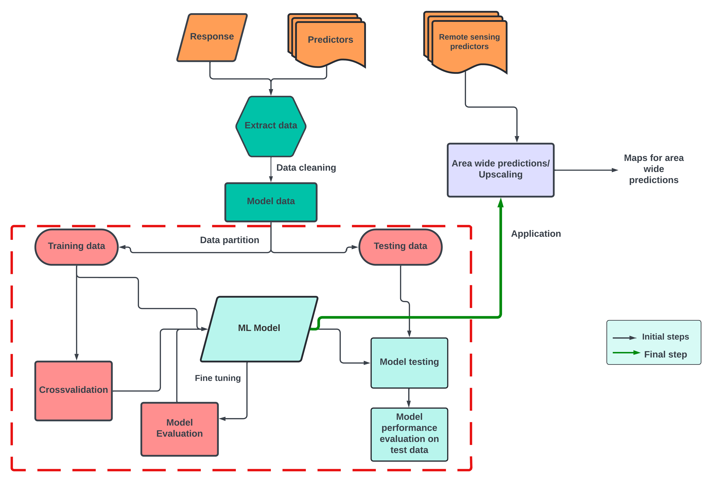
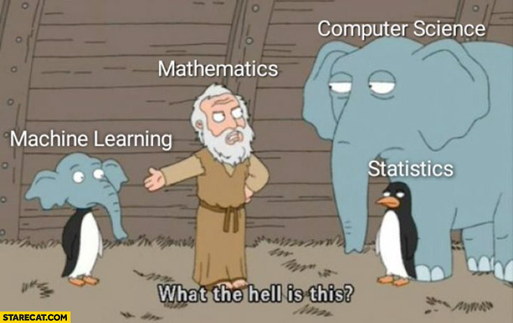

## What is machine learning?

Source : Netra Bhandari

Machine learning is a branch of artificial intelligence which makes use of data and algorithms to mimic the human way of learning, by slowly improving its accuracy!
To put it in a simple way, machine learning is an important component of data science used for making classifications or predictions. Many industries are derive their decisions based on insights derived from such classifications/predictions.

## How machine learning works?

The learning system for a ML can be put in three steps simply :

* Decision part - based on your input data (labelled or unlabelled), a ML alogrithm will try too find a pattern in the data and produce an estimate.
* Error part - the above estimate will also come with an error function, which will help in determining the accuracy of the estimate.
* Optimization part - based on the estimate and error, the model can be adjusted again to reduce the discrepancy between the shown estimate and the error. The algorithm will repeat evaluation and optimisation until it is able to reach the highest accuracy value. 
  
## Learn in detail 

The following videos will give you a more graphical idea of Machine learning. 
Then you will also learn about one the ML algorithms which we will use later - randomForest

You can find all the videos [here](https://geomoer.github.io/moer-bsc-project-seminar-remote-sensing//unit06/unit06-01_machine_learning.html){:target="_blank"}.

## Applications of Machine Learning in biodiversity conservation

* [Perspectives in machine learning for wildlife conservation](https://www.nature.com/articles/s41467-022-27980-y){:target="_blank"}.
* [AI empowers conservation biology](https://www.nature.com/articles/d41586-019-00746-1){:target="_blank"}.

Source: https://www.meme-arsenal.com/en/create/meme/2779341 