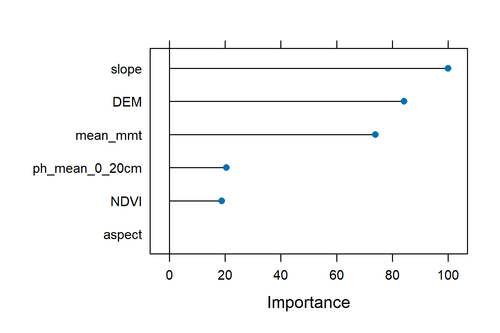

In this part of the course, we will use three models based on Random Forest algorithms.
The three models include: 
* the default Random Forest model using the caret package (short for Classification And REgression Training) developed by Max Kuhn (2008) using random K-fold cross-validation. 
* Random Forest with feature forward selection method using random K-fold cross-validation.
* Random Forest with default and spatial forward feature selection, using `createSpacetimeFolds` cross-validation method. 

```r
rm(list=ls()) # removes all things from current environment
gc() #garbage collector, frees up memory
library(caret)
library(CAST)

#set working directory
setwd("D:/Kili_SES/course_bsc_upscaling_netra/upscaling_methodology")

## load your model data
model_data <- read.csv("./model_data.csv", header = T, row.names = 1) #make sure that you don't have any missing values
model_data <- na.omit(model_data) # omit missing values

# lets rename our columns a bit 

colnames(model_data) <- c("PlotID","DEM","aspect","slope","mean_mmt","ph_mean_0_20cm",
                          "NDVI","cat","SRallplants")

head(model_data, n = 2)

#   PlotID  DEM   aspect      slope   mean_mmt    ph_mean_0_20cm    NDVI  cat    SRallplants
#1   cof1 1282.427 150.4274 6.653354 19.44326       5.735425 0.8201967   cof          59
#2   cof2 1323.978 209.4474 2.701757 19.75905       5.978076 0.7621889   cof          44

#All good data practices begin with data exploration. Lets visualise our dataset using the `featurePlot` function from the caret package.

# create a predictors vector

predictors <- c("DEM","aspect","slope","mean_mmt", "ph_mean_0_20cm","NDVI")

#note - find the full names here
#DEM - Digital Elevation model, mmt - mean minimum temperature, ph_mean - ph with predicted mean values

featurePlot(x = model_data[, predictors], 
            y = model_data$SRallplants, type = c("p", "smooth"),
            plot = "scatter", layout = c(3,2))
            
# notice the pattern of Species richness for each predictor 
```


```r
#############################
# create data partition 
#############################
set.seed(10)

trainIndex <- caret::createDataPartition(model_data$SRallplants, p = .7, # you can experiment with p as 0.8 or 0.5
                                         list = FALSE, 
                                         times = 1)

# use the index values to split the data into training and testing data

featuresTrain <- model_data[ trainIndex,]
featuresTest  <- model_data[-trainIndex,] 

##############################################
#default model - Random Forest-Random k-fold CV
##############################################

```
Now lets understand the model arguments once again.

### Random Forest Model in caret
The Random Forest algorithm is an ensemble learning method that builds multiple decision trees and merges them together to get a more accurate and stable prediction. 
It is commonly used for both classification and regression tasks.
### Key Arguments in caret::train Function for Random Forest

- featuresTrain[, predictors]:This is the matrix or data frame containing your predictor variables (features). Each column represents a feature, and each row represents an observation.
- featuresTrain$SRallplants: This is your target variable or the response variable you want to predict. For regression tasks, this would be a continuous variable.
- method = "rf": Specifies the method to use, which is "rf" for Random Forest.
- tuneGrid = tunegrid:This is a data frame that contains parameters you want to tune. In this case, it's used to specify different values for mtry, which is the number of features to consider at each split in the trees.
- importance = TRUE: If set to TRUE, this argument indicates that the model should calculate the importance of each feature, which can be helpful to understand which features are most influential in making predictions.
- ntree = 200: Specifies the number of trees to grow in the forest. More trees can improve performance but also increase computational cost.
- trControl = trainControl(method = "cv"): Controls the computational nuances of the training process. 
- Here, method = "cv" specifies that cross-validation should be used. Cross-validation helps in assessing how well the model generalizes to an independent dataset by splitting the data into training and validation sets multiple times.
- metric = "RMSE": Specifies the performance metric to be used for evaluating the model. RMSE (Root Mean Squared Error) is commonly used for regression tasks to measure the average magnitude of the errors between predicted and actual values.

Metric can be R square, Mean Absolute Error (MAE) etc. If you are performing a classification, then metrics can include accuracy, precision, recall, F1score, Area Under Curve (AUC).

## Understanding set.seed()
set.seed() ensures that when you split data or build models with random processes, you get the same results every time. This is useful because it allows you to reproduce your exact results, making debugging easier.

- Within the Same R Version: set.seed() will produce identical sequences of random numbers, ensuring reproducibility.
- Across Different R Versions: While set.seed() aims to produce consistent results, changes in R's internal random number generation may cause slight variations between versions.
- The R version used in this exercise from the lecturer was R version 4.4.0 (2024-04-24 ucrt).
{: .notice--info}

## Understanding parallelization
Parallelization splits a task into smaller parts that can be processed simultaneously across multiple CPU cores, speeding up computations. I
t is used to efficiently handle large datasets and complex calculations in model training.

```r
library(caret)

#we will use 'train()' function from the caret library to train our model

## the following section is needed to speed up our model by parallelizing the process
# Install and load the necessary packages
#install.packages("doParallel")
library(doParallel)

# Number of cores to use
numCores <- detectCores() - 1 # Reserve one core for the system

# Register the parallel backend
cl <- makeCluster(numCores)
registerDoParallel(cl)


set.seed(10)
mtry <- seq(1:10)
tunegrid <- expand.grid(mtry=mtry)


model <- train(featuresTrain[,predictors],featuresTrain$SRallplants,
               method="rf",tuneGrid=tunegrid, #data.frame("mtry"=2),
               importance=TRUE,ntree = 200,
               trControl=trainControl(method="cv"), metric = "RMSE") #"Rsquared"

# Stop the cluster
stopCluster(cl)

# Print the model
print(model)

#Random Forest 

#43 samples
#6 predictor

#No pre-processing
#Resampling: Cross-Validated (10 fold) 
#Summary of sample sizes: 38, 38, 39, 38, 40, 39, ... 
#Resampling results across tuning parameters:

#  mtry  RMSE      Rsquared   MAE     
#   1    15.84039  0.4646696  12.69748
#   2    14.97742  0.4760504  11.87233
#   3    14.95889  0.4788128  12.01881
#   4    14.08091  0.5315467  11.25967
#   5    13.75009  0.5621471  11.14809
#   6    13.80387  0.5521847  11.23068
#   7    14.07098  0.5562439  11.15204
#   8    13.87619  0.5555455  11.08187
#   9    13.84102  0.5671046  11.04132
#  10    14.12230  0.5384702  11.56068

#RMSE was used to select the optimal model using the smallest value.
#The final value used for the model was mtry = 5.
```

## Explanation of Results
- Optimal mtry: The model tested mtry values from 1 to 10.
- mtry = 5 was selected as the optimal value because it resulted in the lowest RMSE (13.75), indicating the smallest average prediction error.
- The corresponding R-squared for mtry = 5 was 0.562, suggesting that about 56% of the variance in the target variable was explained by the model.
- The MAE for mtry = 5 was 11.15, indicating the average magnitude of the prediction errors.


## Variable Importance in Random Forest
The varImp(model) function from the caret package provides a measure of the importance of each predictor variable in the Random Forest model. 
This helps us understand which variables are most influential in making predictions.
- Variable Importance: This table shows how much each predictor variable contributes to the accuracy of the model. Higher values indicate greater importance.
- Scale: The importance is often scaled so that the most important variable has a value of 100, making it easier to compare the relative importance of the other variables.

```r

varImp(model)

rf variable importance

                  Overall
# slope           100.00
# DEM              84.29
# mean_mmt         73.96
# ph_mean_0_20cm   20.40
# NDVI             18.71
# aspect            0.00

plot(varImp(model))

```

In our model, slope is the most important variable with a scaled importance of 100, meaning it has the greatest impact on predictions.
DEM and mean_mmt are also highly important. On the other hand, aspect has an importance of 0, indicating it doesn't significantly contribute to the model. 
This information helps us understand which features are most relevant for our predictions and can guide us in focusing on the most impactful variables for further analysis or data collection



## Testing your model
```r
# we will use `predict()` function
featuresTest$pred <- stats::predict(object = model, featuresTest)

rf <- postResample(pred = featuresTest$pred, obs = featuresTest$SRallplants)

#The function postResample can be used to estimate the root mean squared error (RMSE), simple R2, and the mean absolute error (MAE) for numeric outcomes. 
#RMSE       Rsquared        MAE 
#16.5195694  0.3030403 11.1972187 
```

RMSE (16.52): Indicates the average error in our predictions.
R-squared (0.303): Tells us that about 30.3% of the variance in the actual data is explained by our model.
MAE (11.20): Shows the average magnitude of the errors in our predictions.

## Now lets see if we can improve our results

## Task 1

* Design a model with `featureforwardselection` function from CAST package keeping the tunegrid parameters the same as above.
* Generate the summary, check if the ffs model improves R-squared and RMSE values. Plot the variable importance.

```r
## Guiding snippet
#############################################################
# Random Forest with feature forward selection-Random k-fold CV
#############################################################
library(CAST)

# Set a random seed for reproducibility
set.seed(10)

# Register parallel backend
numCores <- detectCores() - 1  # Use one less core than available
cl <- makeCluster(numCores)
registerDoParallel(cl)

# Train the Forward Feature Selection model using Random Forest
ffsmodel <- ffs(featuresTrain[,predictors],featuresTrain$SRallplants,metric="RMSE",
                    method="rf", tuneGrid=tunegrid,
                    verbose=FALSE,ntree=200,
                    trControl=trainControl(method="cv", number = 10))
    
# Stop the parallel backend
stopCluster(cl)
                                  
#print the model
ffsmodel

plot(ffsmodel) #shown below

View(ffsmodel[["perf_all"]]) #to understand the figure use this

featuresTest$pred_ffs <- stats::predict(object = ffsmodel, featuresTest)

ffs <- postResample(pred = featuresTest$pred_ffs, obs = featuresTest$SRallplants)

saveRDS(ffsmodel, "./model_ffs.RDS")

```
This plot shows how the performance of our Random Forest model changes as we add more features during the Forward Feature Selection process. 
The x-axis represents different model runs, and the y-axis shows the Root Mean Squared Error (RMSE), which measures prediction error. 
The colors indicate the number of features used in each model run: red for 2 features, green for 3 features, and blue for 4 features.
 We observe that models with more features (blue) tend to have lower RMSE, indicating better performance. 
The error bars represent the variability in RMSE, with narrower bars indicating more stable models.


## Task 2
* Now additionally use your rf and ffs models with `CreateSpacetimeFolds` and repeat the model evaluation as mentioned in task 1. 

```r
## Guiding snippet
#############################################################
# Random Forest with target oriented validation
#############################################################

set.seed(10)
# Register parallel backend
numCores <- detectCores() - 1  # Use one less core than available
cl <- makeCluster(numCores)
registerDoParallel(cl)
indices <- CreateSpacetimeFolds(featuresTrain,spacevar = "cat",
                                k=12) # 12 unique categories
set.seed(10)
model_LLO <- train(featuresTrain[,predictors],featuresTrain$SRallplants,
                   method="rf",tuneGrid=tunegrid, importance=TRUE,metric="RMSE",ntree = 200,
                   trControl=trainControl(method="cv",
                                          index = indices$index, number = 10))

# Stop the parallel backend
stopCluster(cl)

model_LLO

featuresTest$pred_rf_st <- stats::predict(object = model_LLO, featuresTest)

rf_st <- postResample(pred = featuresTest$pred_rf_st, obs = featuresTest$SRallplants)

saveRDS(model_LLO, "./model_rf_st_folds.RDS")

#############################################################
# Random Forest with ffs and target oriented validation
#############################################################

set.seed(10)
# Register parallel backend
numCores <- detectCores() - 1  # Use one less core than available
cl <- makeCluster(numCores)
registerDoParallel(cl)

indices <- CreateSpacetimeFolds(featuresTrain,spacevar = "cat",
                                k=12) 
set.seed(10)
ffsmodel_LLO <- ffs(featuresTrain[,predictors],featuresTrain$SRallplants,metric="RMSE",
                    method="rf", tuneGrid=tunegrid,
                    verbose=FALSE,ntree=200,
                    trControl=trainControl(method="cv",
                                           index = indices$index))


# Stop the parallel backend
stopCluster(cl)

ffsmodel_LLO
featuresTest$pred_ffs_st <- stats::predict(object = ffsmodel_LLO, featuresTest)
ffs_st<- postResample(pred = featuresTest$pred_ffs_st, obs = featuresTest$SRallplants)

saveRDS(ffsmodel_LLO, "./model_ffs_st_folds.RDS")
```
Comparing our models

```r
## putting all summaries together for comparison

model_names <-  c("rf","ffs","rf_st_folds","ffs_st_folds")
model_summaries <- as.data.frame(cbind(model_names,rbind(model$results[5,],
                                           ffsmodel$results[3,], model_LLO$results[10,], ffsmodel_LLO$results[6,])))
model_summaries


model_summaries
#    model_names mtry     RMSE  Rsquared       MAE   RMSESD RsquaredSD    MAESD
#5            rf    5 13.75009 0.5621471 11.148086 6.768645  0.3208671 5.045456
#3           ffs    3 11.95886 0.6568634  9.809658 4.986383  0.2533350 3.850021
#10  rf_st_folds   10 16.16742 0.3611270 13.890988 7.659483  0.2731115 6.315051
#6  ffs_st_folds    6 13.06543 0.4365756 10.924145 6.332937  0.3971023 5.057476
> 
#you can also use `compare_models` and `resamples` to compare models.

# testing summaries all put together
model_testing <- as.data.frame(cbind(model_names,rbind(rf,ffs,rf_st,ffs_st)))
model_testing

#model_names             RMSE          Rsquared              MAE
#rf               rf 16.5195693907792 0.303040256235425  11.19721875
#ffs             ffs 16.1260139698963  0.33707110585194 11.1109479166667
#rf_st   rf_st_folds  16.118550137219 0.336390952879001 10.6871458333333
#ffs_st ffs_st_folds 16.8455904958433 0.290648500969383 11.6793229166667                                                       
#
```
## Considering all metrics:

Overall Best Model: rf_st_folds
This model has the lowest RMSE (16.12) and the lowest MAE (10.69), making it the best model overall as it minimizes both the average prediction error and the average magnitude of the errors.
Its R-squared (0.336) is also very close to the highest R-squared (0.337), indicating it explains a similar proportion of variance as the best R-squared model.

## Disadvantages of using less data in RandomForest

Using less data in model training can lead to overfitting, underfitting, reduced accuracy, and less robust predictions. It limits the model's ability to generalize to new data, detect rare events, and explore the importance of different features. This can result in an unreliable model that performs well on the training data but poorly on unseen data, making it difficult to trust the model's predictions.


## Additional models
caret package's `train()` supports many other [models](http://topepo.github.io/caret/available-models.html){:target="_blank"}.

## Model tuning: Task 3
Model tuning refers to an exercise to find the optimal hyperparameters of a learning algorithm using a suitable dataset. For a Random Forest algorithm, some of the important hyperparameters include - mtry (refers to number of variables randomly sampled as candidates for each split),
ntree (refers to number of trees to grow), sample size (i.e. number of observations drawn for each tree), node size (refers to minimum number of observations for a terminal node) [Probst et al 2019](https://wires.onlinelibrary.wiley.com/doi/full/10.1002/widm.1301){:target="_blank"}.

Try the following and check model performance

* Explore the function `trainControl()` using caret package - e.g. change the number of folds for K-fold cross-validation.
* Explore the function `tuneGrid()` using caret package - e.g. what happens to a default rf model with mtry = 3.
