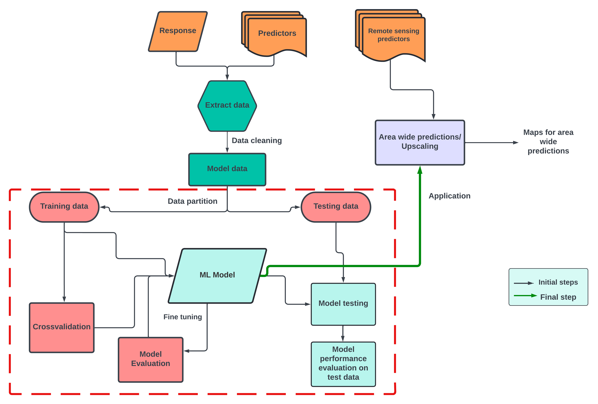

In this part of the course , we will use three models based on randomForest algorithms.
The three models include: 
* the default randomForest model using the caret package (short for Classification And REgression Training) developed by Max Kuhn (2008) using random K fold cross validation. 
* randomForest with feature forward selection method using random K fold cross validation.
* randomForest with default and spatial feature forward selection ; using `createSpacetimeFolds` cross validation method. 

```r
rm(list=ls()) # removes all things from current environment
gc() #garbage collector, frees up memory
library(caret)
library(CAST)

#set working directory
setwd("D:/Kili_SES/course_bsc_upscaling_netra/upscaling_methodology")

## load your model data
model_data <- read.csv("./model_data.csv", header = T, row.names = 1) #make sure that you dont have any missing values

# lets rename our columns a bit 

colnames(model_data) <- c("PlotID","DEM","aspect","slope","mmt","ph_mean_0_20cm","ph_mean_20_50cm",
                          "ph_sd_0_20cm","ph_sd_20_50cm","NDVI_mean","NDVI_sd","cat","SRallplants")

head(model_data, n = 2)

#PlotID      DEM   aspect    slope      mmt ph_mean_0_20cm ph_mean_20_50cm ph_sd_20cm ph_sd_20_50cm
#1   cof1 1282.430 150.5102 6.649611 19.44326     5.735425        5.735425        0.2     0.2144840
#2   cof2 1323.983 209.7581 2.697647 19.75905     5.978076        5.915743        0.2     0.1520235
#  NDVI_mean   NDVI_sd cat SRallplants
#1 0.8543281 0.1302960 cof          59
#2 0.7731032 0.1623179 cof          44

#All good data practices begin with data exploration. Lets visualise our dataset using the `featurePlot` function from the caret package.

# create a predictors vector

predictors <- c("DEM","aspect","slope","mmt",
                "ph_mean_0_20cm","ph_mean_20_50cm","NDVI_mean","ph_sd_0_20cm","ph_sd_20_50cm")

#note - find the full names here
#DEM - Digital Elevation model, mmt - mean minimum temperature, ph_sd - ph with predicted standard deviation

featurePlot(x = model_data[, predictors], 
            y = model_data$SRallplants, type = c("p", "smooth"),
            plot = "scatter", layout = c(5,2))
            
# notice the pattern of Species richness for each predictor 
```


```r
#############################
# create data partition 
#############################
set.seed(10)

trainIndex <- caret::createDataPartition(model_data$SRallplants, p = .7, # you can experiment with p as 0.8 or 0.5
                                         list = FALSE, 
                                         times = 1)

# use the index values to split the data into training and testing data

featuresTrain <- model_data[ trainIndex,]
featuresTest  <- model_data[-trainIndex,] 

##############################################
#default model - randomForest-Random k-fold CV
##############################################

library(caret)

#we will use 'train()' function from the caret library to train our model

set.seed(10)
mtry <- seq(1:10)
tunegrid <- expand.grid(mtry=mtry)


model <- train(featuresTrain[,predictors],featuresTrain$SRallplants,
               method="rf",tuneGrid=tunegrid, #data.frame("mtry"=2),
               importance=TRUE,ntree = 200,
               trControl=trainControl(method="cv"), metric = "Rsquared") #"RMSE"

model

# Random Forest 
# 
# 41 samples
# 9 predictor
# 
# No pre-processing
# Resampling: Cross-Validated (10 fold) 
# Summary of sample sizes: 38, 35, 37, 37, 37, 38, ... 
# Resampling results across tuning parameters:
#   
#   mtry  RMSE      Rsquared   MAE     
# 1    17.73930  0.4318370  14.52130
# 2    18.01508  0.4493241  14.72100
# 3    17.55921  0.3504653  14.36803
# 4    17.21291  0.4530569  14.04124
# 5    17.22446  0.5172236  14.14014
# 6    17.44192  0.3797204  14.32336
# 7    17.34511  0.5067493  14.31080
# 8    17.05172  0.4301227  14.04786
# 9    17.24285  0.4860350  14.12553
# 10    17.25696  0.4271547  14.24301
# 
# Rsquared was used to select the optimal model using the largest value.
# The final value used for the model was mtry = 5.

varImp(model)

# rf variable importance
# 
# Overall
# mmt             100.000
# slope            68.012
# NDVI_mean        63.575
# aspect           48.679
# DEM              42.630
# ph_sd_0_20cm     31.647
# ph_sd_20_50cm     6.015
# ph_mean_0_20cm    1.418
# ph_mean_20_50cm   0.000

plot(varImp(model))

## testing your model
# we will use `predict()` function
featuresTest$pred <- stats::predict(object = model, featuresTest)

postResample(pred = featuresTest$pred, obs = featuresTest$SRallplants)
#The function postResample can be used to estimate the root mean squared error (RMSE), simple R2, and the mean absolute error (MAE) for numeric outcomes. 
# RMSE   Rsquared        MAE 
# 14.1012391  0.5320242 10.6120167 

```


## Task 1

* Design a model with `featureforwardselection` function from CAST package keeping the tunegrid parametrs same as above.
* Generate the summary, check out if the ffs model improves R square and RMSE values. Plot out the variable importance

```r
## Guiding snippet
#############################################################
# randomForest with feature forward selection-Random k-fold CV
#############################################################
library(CAST)

set.seed(10)

ffsmodel <- ffs(featuresTrain[,predictors],featuresTrain$SRallplants,metric="Rsquared",
                    method="rf", tuneGrid=tunegrid,
                    verbose=FALSE,ntree=200,
                    trControl=trainControl(method="cv", number = 10))
                                       
ffsmodel

plot_ffs(ffsmodel) #shown below

View(ffsmodel[["perf_all"]]) #to understand the figure use this

saveRDS(ffsmodel, "./model_ffs.RDS")

```


## Task 2
* Now additionally use your rf and ffs models with `CreateSpacetimeFolds` and repeat the model evaluation as mentioned in task 1. 

```r
## Guiding snippet
#############################################################
# randomForest with target oriented validation
#############################################################

set.seed(10)
indices <- CreateSpacetimeFolds(featuresTrain,spacevar = "cat",
                                k=12) # 12 unique categories
set.seed(10)
model_LLO <- train(featuresTrain[,predictors],featuresTrain$SRallplants,
                   method="rf",tuneGrid=tunegrid, importance=TRUE,metric="Rsquared",ntree = 200,
                   trControl=trainControl(method="cv",
                                          index = indices$index, number = 10))
model_LLO

saveRDS(model_LLO, "./model_rf_st_folds.RDS")
#############################################################
# randomForest with ffs and target oriented validation
#############################################################

set.seed(10)
indices <- CreateSpacetimeFolds(featuresTrain,spacevar = "cat",
                                k=12) 
set.seed(10)
ffsmodel_LLO <- ffs(featuresTrain[,predictors],featuresTrain$SRallplants,metric="Rsquared",
                    method="rf", tuneGrid=tunegrid,
                    verbose=FALSE,ntree=200,
                    trControl=trainControl(method="cv",
                                           index = indices$index))
ffsmodel_LLO
saveRDS(ffsmodel_LLO, "./model_ffs_st_folds.RDS")
```
Comparing our models

```r
## putting all summaries together for comparison
model_names <-  c("rf","ffs","rf_st_folds","ffs_st_folds")
model_summaries <- as.data.frame(cbind(model_names,rbind(model$results,
                                           ffsmodel$results, model_LLO$results, ffsmodel_LLO$results)))

model_summaries
model_names <-  c("rf","ffs","rf_st_folds","ffs_st_folds")
model_summaries <- as.data.frame(cbind(model_names,rbind(model$results[5,],
                                           ffsmodel$results[9,], model_LLO$results[9,], ffsmodel_LLO$results[6,])))


# model_names mtry     RMSE  Rsquared      MAE    RMSESD RsquaredSD     MAESD
# 5            rf    5 17.22446 0.5172236 14.14014  6.881299  0.3318532  5.654379
# 9           ffs    9 15.99191 0.6872892 12.78091  6.072818  0.3295572  4.128790
# 91  rf_st_folds    9 20.38643 0.4854518 17.97130  8.206759  0.4025853  7.790628
# 6  ffs_st_folds    6 23.34073 0.7302329 21.31464 12.879699  0.2325953 12.834397

#you can also use `compare_models` and `resamples` to compare models.
```
## Additional models
caret package's `train()` supports many other [models](http://topepo.github.io/caret/available-models.html).

## Model tuning: Task 3
Model tuning refers to an exercise to find the optimal hyperparameters of a learning algorithm using a suitable dataset. For a ranfomForest algorithm, some of the important hyperparameters include - mtry (refers to number of variables randomly sampled as candidates for each split),
ntree(referes to number of trees to grow), sample size (i.e. number of observations drawn for each tree), node size (refers to minimum number of observations for a terminal node) [Probst et al 2019](https://wires.onlinelibrary.wiley.com/doi/full/10.1002/widm.1301).

Try the following and check model performance

* Explore the function `trainControl()` using caret package - e.g. change the number of folds for k fold cross validation.
* Explore the function `tuneGrid()` using caret package - e.g. what happens to a default rf model with mtry = 3.
