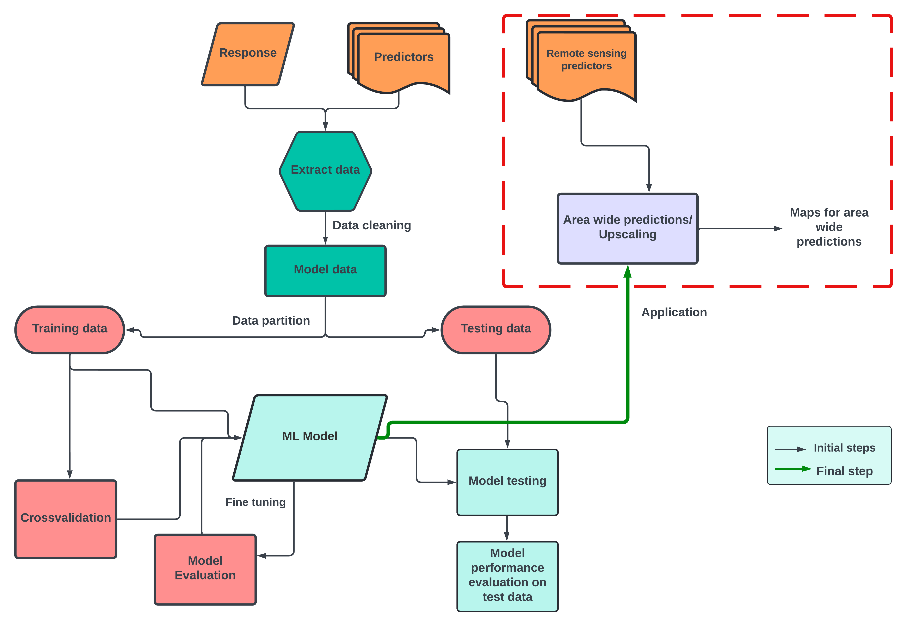

Source: Netra Bhandari

In this section of the upscaling workflow, we carry out our last step, i.e., area-wide predictions. For this we follow two steps 
* Generating a set of remote sensing proxy predictors - cropped to the area you want to upscale to, and
* Using the previously designed model to upscale 

The final results are shown as maps. Taking the processing time into consideration, we show here the upscaled plant richness for FLM category (forest lower montane). 

## Creating a stack of remote sensing predictors 

```r
library(terra)
library(sf)

## generating set of remote sensing predictors

#load in all the available remote sensing proxy variables used in the model
setwd("D:/Kili_SES/course_bsc_upscaling_netra/upscaling_methodology")

predictors <- c("DEM","aspect","slope","mmt",
                "ph_mean_0_20cm","ph_mean_20_50cm","NDVI_mean","ph_sd_0_20cm","ph_sd_20_50cm")

#roi
shp_kili <- sf::st_read("./upscaling_data/vectors/VegAug1_KILI_SES.shp")
shp_kili <- sf::st_transform(shp_kili,  32737)
shp_kili_flm <- terra::vect(shp_kili)

shp_kili_flm <- shp_kili[shp_kili$grid_code == 18,]
shp_kili_flm <- sf::st_transform(shp_kili_flm,  32737) #epsg code for kili is 32737, you can also use UTM 37S
shp_kili_flm <- terra::vect(shp_kili_flm)
ext <- ext(shp_kili_flm)

# ndvi
ndvi <- terra::rast("./upscaling_data/rasters/ndvi.tif") #same as generated in unit 3
ndvi_kili <- terra::crop(ndvi,ext)
names(ndvi_kili) <- "NDVI_mean" #lets maintain the same terminology as the models

## dem 
dem <- terra::rast("./upscaling_data/rasters/kiliDEM_UTM37S.tif")
dem_kili <- terra::crop(dem,ext)
names(dem_kili) <- "DEM"
dem_kili <- terra::resample(dem_kili,ndvi_kili)#10m resolution

# aspect
aspect <- terra::rast("./upscaling_data/rasters/DEM_UTM37S_WGS84_30m_Hemp_aspect.tif")
aspect_kili <- terra::crop(aspect,ext)
names(aspect_kili) <- "aspect"
aspect_kili <- resample(aspect_kili,ndvi_kili)

#slope
slope <- terra::rast("./upscaling_data/rasters/DEM_UTM37S_WGS84_30m_Hemp_slope.tif")
slope_kili <- terra::crop(slope,ext)
names(slope_kili) <- "slope"
slope_kili <- resample(slope_kili,ndvi_kili)

#pH
ph <- terra::rast("./upscaling_data/rasters/ph_kili.tif")
ph <- terra::crop(ph,ext)
ph <- resample(ph,ndvi_kili)
names(ph) <- c("ph_mean_0_20cm","ph_mean_20_50cm","ph_sd_0_20cm","ph_sd_20_50cm")
#mmt
library(raster)
library(geodata)
tanzania_worldClim <- geodata::worldclim_country("Tanzania", var="tmin", res = 10,
                                                 path= getwd())

tanzania_worldClim_projected <- project(tanzania_worldClim, 
                                        ndvi)
mmt_kili <- terra::crop(tanzania_worldClim_projected, 
                                            ext)
plot(mmt_kili)

mean_mmt <-app(mmt_kili, fun=mean)
mean_mmt
names(mean_mmt) <- "mmt"
plot(mean_mmt)

#stack all rasters
predictors_rs <- c(dem_kili,aspect_kili,slope_kili,mean_mmt, ph$ph_mean_0_20cm,ph$ph_mean_20_50cm,ndvi_kili,
                   ph$ph_sd_0_20cm, ph$ph_sd_20_50cm)

names(predictors_rs) #recheck names
ext(predictors_rs) 

# mask all predictors to match the extent of flm area
masked_predictors <- terra::mask(predictors_rs, shp_kili_flm)
plot(masked_predictors)
ext(masked_predictors)
ext(shp_kili_flm)

terra::writeRaster(masked_predictors,"./predictors_rs_flm_masked.tif")

```


## Upscaling 
```r
rm(list=ls())
gc() # needed as AOA calculations will take up lots of space
#libraries
library(terra)
library(caret)
library(CAST)
library(mapview)
library(RColorBrewer)
library(raster)
library(latticeExtra)

#load in predictors
predictors_rs_flm <- raster::stack("./predictors_rs_flm_masked.tif")

mapview::mapview(raster(predictors_rs_flm),col.regions=brewer.pal(9, "YlGn"))

#load in your model
prediction_ffs_st <- raster::predict(predictors_rs_flm,model_ffs_st_folds, na.rm=T)
writeRaster(prediction_ffs_st, "prediction_ffs_st_flm.tif")

mapview::mapview(prediction_ffs_st,col.regions=brewer.pal(9, "YlGn"))

#Note - you can also use predict function using terra package
```

[Full-screen version of the map]({{ site.baseurl }}/assets/misc/ffs_st_prediction.html){:target="_blank"}

# Testing the area of applicability
```r
library(doParallel)
library(parallel)
cl <- makeCluster(4)
registerDoParallel(cl)
#note - make sure you have enough space in your R environment to calculate AOA
AOA <- aoa(predictors_rs_flm,model_ffs_st_folds, cl = cl) # will take some time 
plot(AOA$DI)
plot(AOA$AOA)
```


The result of the `aoa()` function has two layers: the dissimilarity index (DI) and the area of applicability (AOA).
* The DI can range from 0 to Inf, where 0 indicates location having predictor properties that are identical to properties observed in the training data. As the DI values increase, the dissimilarity between observed and predicted values also increase. 
* The AOA consists of two values: 0 indicates that a location is outside of the area of applicability and 1 indicates that the model is inside of the area of applicability. 

In our result, we see that most areas are having low DI values along with AOA of 1. 

## Overlapping preditcions with AOA

```r
library(latticeExtra)
spplot(prediction_ffs_st,main="prediction for the AOA \n(spatial CV error applied)")+
  spplot(AOA$AOA,col.regions=c("grey","transparent"))

```

## Additional reading
[Meyer and Pebesma 2021](https://besjournals.onlinelibrary.wiley.com/doi/10.1111/2041-210X.13650){:target="_blank"}

