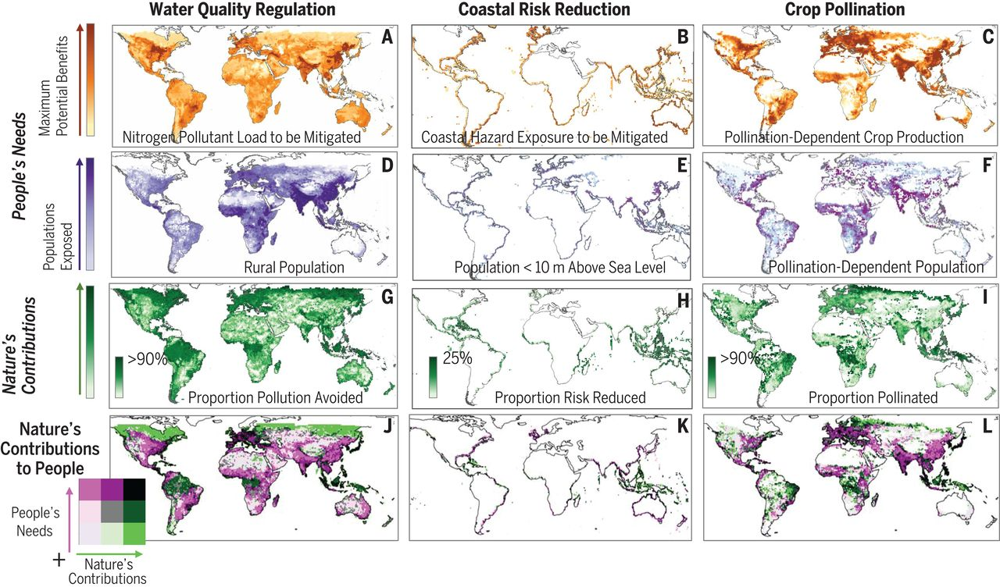

## How to proceed 

In this unit, we have learnt how to upscale plant species richness data.
Now it's your turn

* Start gathering all the datasets 
* Make them analysis-ready
* Try out the shown workflow and see if it works for you
* Start modifying the workflow based on your chosen research project

Source: 'Piled Higher and Deeper' by Jorge Cham www.phdcomics.com

## Additional reading
To understand how the upscaled data becomes useful for designing policies and decision making, and to understand what are the different caveats in global modeling, I recommend reading this interesting paper.
[Global modeling of nature’s contributions to people, Kramer et al 2019](https://www.science.org/doi/10.1126/science.aaw3372).
The pdf version of the paper was also added to ILIAS. 

## Try to answer the following

* What trends are seen in Fig 2. of the paper?

Source: [Kramer et al 2019](https://www.science.org/doi/10.1126/science.aaw3372)

* What are the future scenarios discussed and what are they based on?
* Which parts of the world are shown as the most disadvantaged across all scenarios and why? 

## Preparation for the next session

* Select a video on machine learning from [here](https://geomoer.github.io/moer-bsc-project-seminar-remote-sensing//unit06/unit06-01_machine_learning.html){:target="_blank"}, and explain in your words to others about what you understood from it. 